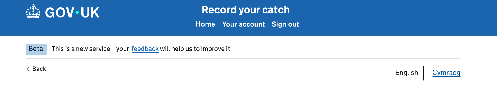
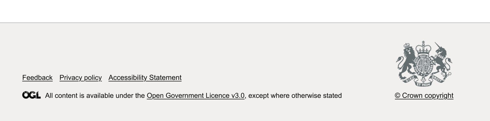
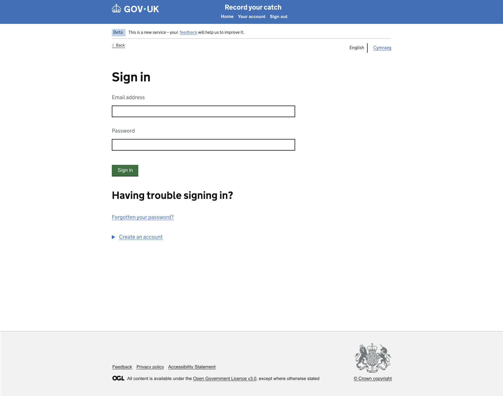

# Step 01: Application Shell and Shared Page Layout

## 1. Title

Catch Record Web UI: Step 01 - Implement the Application Shell and Shared Page Layout

## 2. Agent Workflow

Use only the agents required for each stage of this task.

### Stage A: Planning

**Agent:** `.github/agents/frontend-planner.agent.md`

**Thinking effort:** High

Responsibilities:

1. Inspect the existing repository before proposing changes.
2. Identify the current Nunjucks layout hierarchy, GOV.UK Frontend integration, routing conventions, localisation approach, test framework, and reusable components.
3. Compare the supplied PNG with existing application patterns.
4. Produce a detailed implementation plan.
5. List the files expected to be created or modified.
6. Identify risks, assumptions, dependencies, and ambiguities.
7. Stop after producing the plan and wait for approval before implementation.

After approval, save the approved plan to:

```text
design/plans/01-application-shell-layout.md
```

Do not use the orchestrator agent for this stage.

### Stage B: Implementation

**Agent:** `.github/agents/frontend-developer.agent.md`

**Thinking effort:** Medium

Use High thinking effort only if repository inspection reveals that the shell requires significant changes to routing, localisation, session state, or inherited templates.

Responsibilities:

1. Implement only the approved plan.
2. Follow existing repository conventions.
3. Implement the shared shell, reusable layout regions, responsive behaviour, and tests.
4. Run the relevant checks and report the results.
5. Do not begin unrelated page implementation.

Do not use the orchestrator agent for this stage unless the approved plan demonstrates that coordination across multiple independent technical domains is unavoidable.

### Stage C: Review

**Agent:** `.github/agents/frontend-code-reviewer.agent.md`

**Thinking effort:** Medium

Responsibilities:

1. Review the implementation against this prompt and the approved plan.
2. Check architecture, Nunjucks composition, accessibility, security, localisation, tests, responsive behaviour, and unintended changes.
3. Distinguish blocking findings from non-blocking recommendations.
4. Do not rewrite the implementation unless explicitly instructed.

### Supporting skills and instructions

Inspect and apply all relevant repository guidance, including:

```text
.github/copilot-instructions.md
.github/instructions/accessibility.instructions.md
.github/instructions/figma-design.instructions.md
.github/instructions/nodejs-nunjucks.instructions.md
.github/instructions/security.instructions.md
.github/instructions/testing.instructions.md
```

Use the following skills where relevant:

```text
.github/skills/figma-to-web-ui/
.github/skills/unit-tests/
.github/skills/web-accessibility-audit/
```

The PNG supplied with this prompt is the primary visual reference. The Figma URL is supplementary because the Figma connection may be unreliable.

## 3. Objective

Implement the reusable application shell and shared page-layout infrastructure for the Catch Record Web UI.

The shell must provide a consistent GOV.UK-style foundation for all later happy-path screens without implementing the business content of those screens.

## 4. Design References

### Figma page URL

```text
https://www.figma.com/design/9Jve7RKNprYeeaNYsbTUH1/MMO-Catch-Records?node-id=48-24445&t=ffkmqdjC5IXaXW7u-0
```

### PNG screen reference

Header


Footer


Full layaut smple page



### Reference precedence

When references differ, use the following order:

1. Explicit requirements and corrections in this prompt.
2. Existing application conventions that are required for compatibility.
3. Supplied PNG for visual layout and positioning.
4. Figma page for supplementary measurements and design details.
5. GOV.UK Design System patterns.

Do not invent missing content or behaviour. Record uncertainties in the plan and ask for clarification when the uncertainty affects implementation.

## 5. Background Context

The Catch Record Web UI supports a multi-page journey for recording and submitting catch information.

Later steps will implement screens such as:

- Privacy Notice
- Guidance
- Sign In
- All Records
- Create Draft Record
- Vessel selection
- Trip details
- Skipper details
- Gear selection
- Statistical area
- Species and weights
- Not-landed catch
- Check Your Answers
- Confirmation

This task establishes the reusable shell those pages will extend.

The repository already contains a GitHub Copilot agent and skill framework. Reuse that framework and the existing application architecture rather than introducing a parallel structure.

## 6. Critical Constraints

1. Do not implement the content or business logic of later journey screens.
2. Do not hard-code a Back link inside the shared header.
3. Do not hard-code a Back link destination in the base layout.
4. Do not use `window.history.back()` as the default navigation strategy.
5. Do not place page-specific navigation inside the global header component.
6. Do not add breadcrumbs. The service uses a Back link for the transactional journey.
7. Do not introduce a new CSS framework or component library.
8. Do not replace GOV.UK Frontend components with custom equivalents when an appropriate component exists.
9. Do not add runtime dependencies unless the approved plan demonstrates that they are essential.
10. Do not change authentication, infrastructure, database configuration, deployment workflows, or unrelated routes.
11. Do not use absolute positioning to align the Back link and language selector.
12. Do not rely on a live Figma connection to complete the task.
13. Preserve existing behaviour and styling outside the approved scope.
14. Follow progressive-enhancement principles. Core navigation and content must work without client-side JavaScript where practical.

## 7. Required Outcome

After this task:

1. Pages can extend a shared Nunjucks layout.
2. The service renders the existing required government or organisational branding consistently.
3. The service name is presented in the appropriate shared navigation region according to the existing project pattern.
4. A skip link allows keyboard users to move directly to the main content.
5. A shared pre-main navigation region exists below the header and before the `<main>` element.
6. The pre-main region supports an optional, page-specific Back link on the left.
7. The pre-main region supports a persistent English/Cymraeg language selector on the right.
8. Pages without a Back link retain a deliberate and accessible layout.
9. Routes or page controllers can supply an explicit Back link URL and optional text.
10. Changing language can preserve the logical current page and can be integrated with journey-state preservation.
11. The shell provides a clearly identified main-content container.
12. The shell provides a reusable approach for page titles, validation summaries, notifications, and page-specific content.
13. The footer is shared and consistently positioned.
14. The layout responds correctly on mobile, tablet, and desktop widths.
15. Automated tests cover the shared layout behaviour.
16. Accessibility checks identify no new blocking issues.

## 8. Scope

### In scope

- Repository and architecture inspection
- Base Nunjucks layout or refinement of the existing base layout
- GOV.UK template inheritance
- Skip link integration
- Shared header integration
- Service navigation integration where required by the existing architecture
- Shared footer integration
- Shared pre-main navigation row
- Optional Back link API or page-level configuration
- Persistent English/Cymraeg selector placement
- Main content landmark and stable `id` target
- Page title composition
- Generic slot or block for error summaries
- Generic slot or block for notifications
- Shared container widths
- Responsive alignment and spacing
- Unit, rendering, integration, and accessibility tests applicable to the shell
- Minimal documentation explaining how later pages use the layout

### Out of scope

- Full bilingual content translation
- Translation-service implementation unless an existing mechanism only needs to be wired into the layout
- Catch-record business rules
- Form fields for later screens
- Authentication implementation
- Dashboard records
- Persistent database state
- API changes
- Infrastructure or deployment changes
- Redesigning existing branding
- Breadcrumbs
- JavaScript-only Back navigation
- Implementing all later routes merely to demonstrate the shell

## 9. Current State Inspection

Before planning, inspect the repository and report findings for:

1. Existing base layouts and template inheritance.
2. Existing GOV.UK Frontend version and configuration.
3. Existing header, service navigation, footer, Back link, and language-selector components.
4. Existing route-to-view-model conventions.
5. Existing localisation and language-switching behaviour.
6. Existing session or journey-state mechanisms.
7. Existing Sass structure, naming conventions, and spacing utilities.
8. Existing unit, integration, accessibility, and snapshot test approaches.
9. Existing page-title format.
10. Existing error-summary and notification patterns.
11. Existing responsive breakpoints and browser support.
12. Any conflict between this prompt, the PNG, and current implementation.

Do not assume filenames. Use repository inspection to identify the actual locations.

## 10. Target Page Structure

Implement or preserve this logical document order:

```text
<body>
  Skip link
  Shared global header
  Shared service navigation, when applicable
  Pre-main page navigation
    Optional contextual Back link
    Persistent English/Cymraeg selector
  Main content
    Optional notification region
    Optional error summary
    Page-specific content
  Shared footer
</body>
```

The DOM order must remain logical for keyboard and screen-reader users.

## 11. Design and GDS Requirements

### 11.1 Header

Use the existing GOV.UK or department-approved header implementation.

The global header must contain only globally appropriate content, such as:

- Government or organisation branding
- GOV.UK-wide tools already required by the application
- Existing account-level navigation when it is genuinely global

Do not put the contextual Back link inside the header.

### 11.2 Service navigation

Use the GOV.UK Service Navigation pattern if the project already uses it or if the approved plan establishes that it is required.

The service name should link to the service home or closest equivalent route, based on existing project conventions.

Avoid adding unnecessary navigation links to this linear transactional journey.

### 11.3 Pre-main navigation row

Create a reusable region after the header or service navigation and before `<main>`.

Desktop and tablet positioning:

- Use the same width container as the main content.
- Align the Back link with the left edge of the main content.
- Align the English/Cymraeg selector with the right edge of the width container.
- Keep both controls on the same visual row when sufficient width is available.
- Use normal document flow with flexbox or existing GOV.UK layout utilities.

Mobile positioning:

- Allow the row to wrap or stack without overlap.
- Keep the Back link before the language selector in DOM and keyboard order unless the existing accessible pattern requires otherwise.
- Maintain visible separation between the navigation controls and main content.
- Do not use absolute positioning.

The shell owns the region and its layout. Each page or route owns whether a Back link is present and where it points.

### 11.4 Back link

Use the GOV.UK Back Link component or the existing approved project wrapper.

Support page-level data equivalent to:

```text
backLink.href
backLink.text
```

The actual property names must follow existing project conventions.

Requirements:

- Render only when valid Back link data is supplied.
- Default visible text to `Back` for English if the existing localisation system supports defaults.
- Support translated text through the existing localisation mechanism.
- Use an explicit server-generated route.
- Preserve previously entered journey data through the existing state mechanism.
- Do not infer the previous destination from browser history.
- Do not render an empty or inactive Back link placeholder to assist visual alignment.

### 11.5 Language selector

Use an existing approved English/Cymraeg pattern if one is already present.

Requirements:

- Present the available language change clearly.
- Identify the current page language accessibly.
- Keep the user on the equivalent logical page when the language changes.
- Preserve existing journey data.
- Preserve the logical Back link destination.
- Use correct `lang` attributes and accessible names.
- Avoid presenting the current language as a misleading link if the existing pattern does not do so.

This task should provide shell-level integration points. Do not build a new translation platform.

### 11.6 Main content

- Use one `<main>` landmark.
- Provide a stable target for the skip link, normally `main-content` unless the project uses another established identifier.
- Move programmatic focus appropriately after navigation or validation according to existing GOV.UK patterns.
- Allow pages to render one primary `<h1>`.
- Do not render a generic visible page heading from the shell if individual pages own the heading.

### 11.7 Error summary and notifications

Provide reusable blocks, macros, or view-model integration points for:

- GOV.UK Error Summary
- Success or informational notifications where the application requires them

Do not show empty regions.

Error-summary links must be capable of targeting the corresponding invalid controls on later form pages.

### 11.8 Footer

Use the existing shared footer.

The footer must follow the width container and spacing conventions used by the application and must not be positioned in a way that overlays short pages.

## 12. Positioning and Spacing

Use GOV.UK spacing tokens or the repository's established wrappers. Do not introduce arbitrary pixel values when an existing token applies.

Apply these principles, adapting exact token choices to the inspected GOV.UK version and existing application styles:

1. Header and service navigation span their intended full width.
2. Inner header, navigation, pre-main, main, and footer content align to the same width-container grid.
3. The pre-main navigation row begins below the header or service-navigation boundary.
4. Maintain clear vertical separation between the pre-main row and page-specific content.
5. A page-level `<h1>` should align with the main content column, not the right edge of the language selector.
6. Standard content pages should use an appropriate readable width, commonly two-thirds where the design and existing templates support it.
7. Do not force all future forms to full container width.
8. Do not add empty elements solely to create spacing.
9. Ensure wrapping language links do not collide with the Back link at narrow widths.
10. Validate alignment against the supplied PNG at representative viewport widths.

In the plan, identify the exact GOV.UK classes, Sass mixins, or existing project utilities proposed for:

- Width container
- Pre-main row
- Horizontal alignment
- Vertical spacing
- Mobile wrapping
- Main content top and bottom spacing

## 13. View-Model and Template Contract

Define a small, documented contract that later routes can use without coupling route handlers to markup details.

The contract should cover, using existing project naming conventions:

- Page title
- Language
- Optional Back link URL
- Optional Back link text
- Language-switch URL or route parameters
- Optional error summary
- Optional notification
- Page-specific content block

Avoid a large generic configuration object if the current application favours Nunjucks blocks or context composition.

Include brief examples in developer documentation or tests showing:

1. A page with a Back link.
2. A page without a Back link.
3. A page in English.
4. A page in Cymraeg or using the existing localisation mechanism.

Examples must not implement a full later journey screen.

## 14. Error Handling Requirements

- Do not render broken navigation when optional values are absent.
- Validate or safely handle malformed internal Back link data using existing project conventions.
- Do not expose stack traces, internal paths, session data, or sensitive configuration.
- Preserve accessible page output when language data is unavailable.
- Use the existing application error-handling approach.
- Do not silently redirect the user to an unrelated journey step.

## 15. Security Requirements

- Escape dynamic text through Nunjucks defaults and existing safe rendering rules.
- Do not mark route-supplied content as safe unless the source is trusted and the project explicitly requires it.
- Restrict navigation URLs to expected internal routing behaviour using existing application conventions.
- Preserve existing security middleware and headers.
- Do not expose journey or user information in HTML comments, logs, or client-side configuration.

## 16. Accessibility Requirements

Meet WCAG 2.2 AA and the repository accessibility instructions.

Verify at minimum:

1. Skip link is the first relevant focusable control and targets the main content.
2. Header and footer landmarks are correct.
3. Only one main landmark exists.
4. Back link is before main content.
5. Back link has a clear accessible name.
6. Language selector has an understandable accessible name and current-language indication.
7. Keyboard focus order follows visual and logical order.
8. Focus indicators are visible.
9. The layout works at 200% and 400% zoom.
10. The pre-main row reflows without horizontal scrolling at 320 CSS pixels, except where a legitimate exception applies.
11. Page titles identify the page and service.
12. Empty error or notification regions are not announced.
13. Colour and contrast rely on GOV.UK tokens or existing approved styles.
14. Navigation does not depend on colour, position, or JavaScript alone.

Run the repository's accessibility checks and the `web-accessibility-audit` skill during implementation or review as appropriate.

## 17. Responsive Requirements

Validate at least:

```text
320px
768px
1024px
1440px
```

Check:

- No overlap between Back link and language selector.
- No clipped text.
- No inappropriate horizontal scrolling.
- Consistent left alignment between pre-main and main content.
- Correct wrapping or stacking of navigation controls.
- Footer remains in normal document flow.
- Zoom and text-spacing changes do not break the layout.

## 18. Testing Requirements

Follow `.github/instructions/testing.instructions.md` and use the existing test stack.

### Unit and rendering tests

Cover at minimum:

1. Base layout renders the shared header.
2. Base layout renders the service name in the expected region.
3. Skip link points to the main content target.
4. Main content target exists exactly once.
5. Footer renders.
6. Back link renders when valid page-level data is supplied.
7. Back link does not render when data is absent.
8. Back link uses the supplied explicit URL.
9. Back link supports supplied translated text.
10. Language selector renders in the pre-main region.
11. Empty error summary is not rendered.
12. Supplied error summary renders in the intended location.
13. Page-title composition follows the application convention.

### Integration tests

Where supported by the current project, cover:

1. A representative route renders the shell.
2. A representative route with a Back link returns the expected markup and URL.
3. A representative route without a Back link does not contain an empty Back control.
4. Switching language remains on the equivalent logical route, using existing localisation behaviour.
5. Existing routes remain operational.

### Accessibility tests

Run existing automated accessibility tests against representative shell states:

- With Back link
- Without Back link
- English
- Cymraeg, if the existing localisation mechanism supports it during this step
- Error-summary state

Do not rely on snapshots alone. Assert important semantics and behaviour explicitly.

## 19. Documentation Requirements

Add or update concise developer documentation explaining:

- How a page extends the shared layout.
- How a route supplies an optional Back link.
- Why the Back link is outside the header.
- How the pre-main navigation row behaves responsively.
- How the language selector is integrated.
- How a future page supplies an error summary or notification.
- Which tests verify the shell.

Avoid duplicating general GOV.UK documentation.

## 20. Files and Areas to Inspect First

Discover actual paths rather than assuming filenames. Begin by inspecting:

```text
.github/copilot-instructions.md
.github/agents/
.github/instructions/
.github/skills/
src/
test-helpers/
package.json
```

Within `src/`, locate:

- Nunjucks layouts
- Partials and macros
- GOV.UK configuration
- Route handlers and controllers
- Sass entry points and components
- Localisation utilities
- Error handlers
- Existing shared view models

Also inspect existing tests and any example or prototype screens that use the current shell.

## 21. Suggested Files to Modify

The planning agent must identify the actual files after inspection.

Likely areas include:

- Existing base layout
- Existing header or service-navigation partial
- Existing footer partial
- A new or existing page-navigation partial
- Existing language-selector component
- Shared Sass component or layout stylesheet
- Representative route fixture or lightweight example used by tests
- Layout rendering tests
- Accessibility tests
- Developer documentation

Only modify other files when necessary and explain the reason in the plan.

## 22. Delivery Plan Rules

### Planning stage instructions

Before changing code, the planning agent must produce:

1. Repository findings.
2. Proposed architecture.
3. Template and view-model contract.
4. Proposed component hierarchy.
5. Proposed responsive and spacing approach.
6. Exact files to create or modify.
7. Test plan.
8. Accessibility plan.
9. Risks and mitigations.
10. Ambiguities requiring clarification.
11. Confirmation that the orchestrator is not required, or a specific evidence-based explanation if it is required.

Do not make code changes during the planning stage.

Stop and wait for approval.

### After plan approval

The first action after plan approval is to save the approved plan at:

```text
design/plans/01-application-shell-layout.md
```

Then use the frontend developer agent to implement only the approved plan.

### Implementation stage instructions

Before editing, the developer agent must:

1. Read the approved plan.
2. Re-read all relevant repository instructions.
3. Confirm the files that will be changed.
4. Confirm that no unrelated areas will be modified.

During implementation:

1. Make small, coherent changes.
2. Reuse existing GOV.UK and repository components.
3. Add or update tests with the implementation.
4. Run focused checks after each coherent change where practical.
5. Do not expand scope without approval.

At completion, report:

- Files changed
- Behaviour implemented
- Tests executed and results
- Accessibility checks executed and results
- Manual verification completed
- Remaining risks or limitations
- Any approved-plan deviation and its reason

### Review stage instructions

The reviewer must assess:

- Compliance with this prompt
- Compliance with the approved plan
- Shared layout composition
- Correct separation of header, pre-main navigation, and main content
- Back link ownership and routing behaviour
- Language selector behaviour
- GDS component usage
- Responsive spacing and positioning
- Accessibility
- Security
- Test quality
- Regression risk

Classify findings as:

```text
Blocking
Important
Suggestion
```

## 23. Manual Verification Requirements

After automated tests pass:

1. Start the application using the documented local command.
2. Open a representative page with no Back link.
3. Confirm that the header, language selector, main content, and footer align correctly.
4. Open a representative page with a Back link.
5. Confirm that the Back link appears below the header and before main content.
6. Confirm that the Back link destination is explicit and correct.
7. Navigate using only the keyboard.
8. Activate the skip link and confirm focus moves to main content.
9. Switch between English and Cymraeg using the existing mechanism.
10. Confirm the logical page is preserved.
11. Confirm that relevant journey state is not lost where state already exists.
12. Test at 320px, 768px, 1024px, and 1440px.
13. Test at 200% browser zoom and, where practical, 400% zoom.
14. Confirm the Back link and language selector do not overlap.
15. Confirm no empty Back link placeholder is rendered.
16. Confirm the browser title follows the service convention.
17. Confirm there are no new browser-console errors.

## 24. Acceptance Criteria

The task is complete only when:

- [ ] The approved plan is saved in `design/plans/01-application-shell-layout.md`.
- [ ] The implementation follows existing repository architecture.
- [ ] Header, service navigation where applicable, pre-main navigation, main content, and footer are distinct structural regions.
- [ ] The Back link is not inside the header.
- [ ] The Back link is optional and controlled by page or route data.
- [ ] The Back link uses an explicit URL rather than browser history by default.
- [ ] The English/Cymraeg selector occupies the shared pre-main region on the right at wider widths.
- [ ] The Back link occupies the left of that region when present.
- [ ] Controls wrap or stack accessibly at narrow widths.
- [ ] A skip link targets the main content correctly.
- [ ] The document contains one main landmark.
- [ ] Shared page-title behaviour is correct.
- [ ] Empty error and notification regions are not rendered.
- [ ] Representative tests cover states with and without a Back link.
- [ ] Existing routes and tests remain stable.
- [ ] Accessibility checks pass with no new blocking issue.
- [ ] Manual responsive verification is complete.
- [ ] Documentation explains how later pages use the shell.
- [ ] No unrelated dependency, infrastructure, authentication, or business-feature change is included.

## 25. Quality Requirements

- Follow existing coding and Nunjucks conventions.
- Prefer GOV.UK components and spacing tokens.
- Keep the layout API small and explicit.
- Avoid duplicated markup.
- Avoid unnecessary abstractions.
- Avoid arbitrary CSS values.
- Preserve progressive enhancement.
- Ensure semantic HTML and logical focus order.
- Keep tests behaviour-focused.
- Keep the implementation ready for later screen prompts without prematurely implementing those screens.

## 26. Final Instruction

If you reach any ambiguity ask me to clarify.
