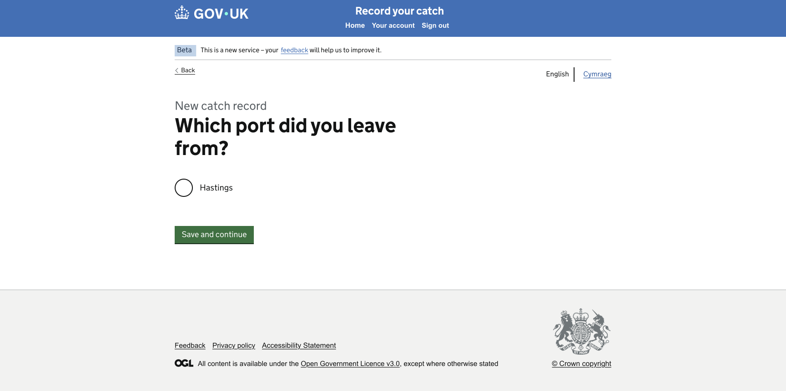
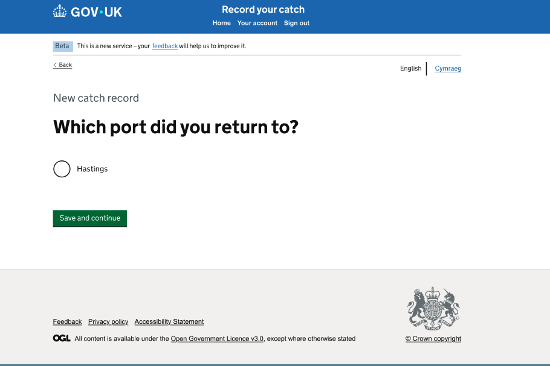

# Step 10: Departure and Return Ports

## 1. Title

Catch Record Web UI: Step 10 - Implement Departure and Return Port Selection

## 2. Agent Workflow and Thinking Effort

Use only the agents required for this task.

### Planning

**Agent:** `.github/agents/frontend-planner.agent.md`

**Thinking effort:** High

The planning agent must:

1. Inspect the current repository and all approved plans from preceding journey steps.
2. Identify the existing routing, Nunjucks, journey-state, validation, localisation and test patterns.
3. Inspect the supplied departure-port and return-port PNG images carefully.
4. Transcribe the visible wording from the PNG images exactly.
5. Map the visible controls to appropriate GOV.UK Design System components.
6. Define the route sequence, Back link destinations, validation behaviour and state persistence.
7. Identify exact files to create or modify.
8. Identify risks, dependencies and genuine ambiguities.
9. Produce a detailed implementation plan and stop for approval.

After plan approval, the first action must be to save the approved plan as:

```text
design/github-prompts/Step 10-departure-return-ports-plan.md
```

The plan filename deliberately begins with `Step ` and uses the same step name as this prompt.

### Implementation

**Agent:** `.github/agents/frontend-developer.agent.md`

**Thinking effort:** Medium

Use High thinking effort only if repository inspection reveals complex journey-state migration or an established reusable port-selection feature that requires careful integration.

The implementation agent must:

1. Read the approved saved plan.
2. Implement only the approved scope.
3. Reuse the common application shell and existing journey patterns.
4. Add or update focused tests.
5. Run the relevant validations and report the results.

### Review

**Agent:** `.github/agents/frontend-code-reviewer.agent.md`

**Thinking effort:** Medium

The reviewer must assess:

- Compliance with this prompt and approved plan
- Fidelity to both supplied PNG images
- GDS component usage
- Journey-state behaviour
- Validation and error handling
- Accessibility
- Responsive layout
- Test quality
- Regression risk

Classify findings as:

```text
Blocking
Important
Suggestion
```

### Orchestrator

Do not use `.github/agents/frontend-orchestrator.agent.md` for this task. The departure-port and return-port screens form one contained frontend journey step and do not require orchestration.

## 3. Objective

Implement the Departure Port and Return Port pages in the Catch Record journey.

The user must be able to select the port from which the fishing trip departed, continue to the Return Port page, select the port to which the trip returned and continue to the next approved journey step.

Both selections must persist in the existing editable JSON journey-state object and be available when the user navigates backwards or resumes the journey.

## 4. Background Context

Catch Recording is a frontend-only application with no backend or database.

All dummy and journey data must be stored in editable JSON object files using the repository's established state pattern. Do not introduce a backend, database, remote API or hidden hard-coded data source.

This step follows the approved trip-date journey. It precedes the next approved Catch Record step.

The shared application shell, header, centred main menu, Back link region, English/Cymraeg selector and footer have already been implemented. Reuse those components without redesigning them.

## 5. Visual Sources of Truth

### Departure Port Figma URL

```text
https://www.figma.com/design/9Jve7RKNprYeeaNYsbTUH1/MMO-Catch-Records?node-id=48-25155&t=ffkmqdjC5IXaXW7u-0
```

### Departure Port PNG

```text
https://www.figma.com/design/9Jve7RKNprYeeaNYsbTUH1/MMO-Catch-Records?node-id=48-27232&t=ffkmqdjC5IXaXW7u-0
```

### Return Port Figma URL



### Return Port PNG



The supplied PNG for each screen is the primary visual source of truth because the Figma connection is not reliable.

For visible wording, labels, hint text, control type, component order, component position and spacing, follow the corresponding PNG even if this prompt, a journey map or earlier planning material uses different wording.

Use this precedence:

1. The corresponding supplied PNG for visible UI wording and presentation.
2. Explicit functional and technical constraints in this prompt.
3. Existing approved application architecture and shared components.
4. Figma URL for supplementary design information.
5. Journey documentation for route context.
6. GOV.UK Design System guidance where the design does not resolve a detail.

Do not silently replace visible PNG wording with wording from this prompt. If a genuine conflict affects behaviour rather than presentation, ask for clarification.

## 6. Critical Constraints

1. Implement only the Departure Port and Return Port pages and their direct navigation.
2. Do not implement later skipper, gear, statistical-area, species, review or submission pages.
3. Do not redesign the shared header, logo, menu, phase banner, language selector, Back link region or footer.
4. Keep the existing logo size and white middle dot unchanged.
5. Keep the main menu centred within the blue header area.
6. Keep the footer top border as a thin grey line.
7. Do not add a backend, database or remote data call.
8. Store dummy port choices in an editable JSON object file.
9. Store selected values through the existing frontend journey-state pattern.
10. Do not hard-code port choices directly in the Nunjucks template.
11. Do not invent port names. Use the port choices shown in the supplied PNG or the approved editable JSON data source.
12. Do not change visible screen wording away from the PNG.
13. Do not use browser history for the Back links.
14. Do not add autocomplete, search, radios, checkboxes or a select control unless that is the control shown in the PNG or already explicitly approved.
15. Do not add chronological trip-date validation in this step.
16. Do not add new dependencies.
17. Do not refactor unrelated code.
18. Do not use arbitrary pixel positioning or absolute positioning to approximate the design.

## 7. Required Outcome

After this task:

1. The approved previous trip-date route can navigate to the Departure Port page.
2. The Departure Port screen matches its PNG.
3. The user can make the port selection shown by the design.
4. Submitting a valid departure port stores the choice and navigates to Return Port.
5. The Return Port screen matches its PNG.
6. The user can make the return-port selection shown by the design.
7. Submitting a valid return port stores the choice and navigates to the next approved journey route.
8. Both pages restore the saved selection when revisited.
9. Both Back links use explicit route destinations and retain entered data.
10. Empty or invalid submission displays an accessible inline error and error summary using the precise approved wording.
11. Port data comes from an editable JSON object file.
12. Relevant tests pass.
13. Both screens meet WCAG 2.2 AA expectations.

## 8. Scope

### In scope

- Departure Port GET and POST routes, or the repository's equivalent pattern
- Return Port GET and POST routes, or equivalent
- Route/controller logic
- Nunjucks templates
- Port options in an editable JSON object file
- Existing journey-state integration
- Restoring prior selections
- Required-field validation
- Error summary and inline error presentation
- Explicit Back and Continue navigation
- English/Cymraeg integration through existing shared mechanisms
- Unit, route, rendering, integration and accessibility tests
- Responsive visual verification

### Out of scope

- Adding or managing account ports
- Port administration
- Remote port lookup
- Backend or database persistence
- Autocomplete unless explicitly shown in the PNG
- Trip-date changes
- Skipper details
- Gear information
- Statistical area
- Species and weights
- Check Your Answers
- Submission and confirmation
- Full Welsh translation infrastructure
- Shared shell redesign

## 9. Repository Areas to Inspect First

Inspect actual repository paths rather than assuming filenames:

```text
.github/copilot-instructions.md
.github/instructions/accessibility.instructions.md
.github/instructions/figma-design.instructions.md
.github/instructions/nodejs-nunjucks.instructions.md
.github/instructions/security.instructions.md
.github/instructions/testing.instructions.md
.github/skills/figma-to-web-ui/
.github/skills/unit-tests/
.github/skills/web-accessibility-audit/
design/github-prompts/
src/
test-helpers/
package.json
```

Specifically locate:

1. The approved Step 09 route and saved journey state.
2. The existing shared layout and page-navigation contract.
3. Existing question-page templates.
4. Existing radio, select, autocomplete or other relevant control patterns.
5. Existing error-summary and inline-error construction.
6. Existing editable JSON fixture or object-file conventions.
7. Existing session or frontend journey-state helper.
8. Existing localisation approach.
9. Existing route/controller tests.
10. Existing accessibility-test setup.

## 10. Journey Flow

Implement the exact approved equivalent of:

```text
Approved previous trip-date page
  -> Departure Port
     -> Return Port
        -> Next approved journey step
```

### Back navigation

```text
Departure Port
  -> explicit previous trip-date route

Return Port
  -> explicit Departure Port route
```

The planning agent must discover the exact current route names and next-step dependency from the repository and approved plans.

Do not create duplicate journey state when navigating forwards or backwards.

## 11. Screen Requirements

### 11.1 Departure Port

Implement the exact visible content, control and ordering shown in the Departure Port PNG.

The screen must include only the page-specific elements shown in the design, together with existing shared-shell components.

The route must:

- Load port options from the approved editable JSON object file.
- Restore the existing departure-port choice when present.
- Validate required input on submission.
- Save a valid selection to the existing journey state.
- Navigate to Return Port after successful submission.

### 11.2 Return Port

Implement the exact visible content, control and ordering shown in the Return Port PNG.

The route must:

- Load port options from the same approved editable JSON data source unless the design explicitly requires a different set.
- Restore the existing return-port choice when present.
- Validate required input on submission.
- Save a valid selection to the existing journey state.
- Navigate to the next approved route after successful submission.

Do not assume the departure and return ports must be different. Add such a rule only if an approved business rule or supplied design explicitly requires it.

## 12. GDS Component Selection

Use the supplied PNG to determine the exact input type.

### Page heading and question

Use the semantic hierarchy shown in the design. Normally:

```text
govuk-heading-xl
```

or a GOV.UK form `fieldset` and `legend` styled as the page heading when the page presents a single grouped question.

If the control is a radio group, use the GOV.UK Radios macro with the question in the `legend` and `isPageHeading: true` where consistent with repository conventions.

If the control is a select, use the GOV.UK Select component.

If the design uses an accessible autocomplete already supported by the repository, reuse that established component. Do not add a new autocomplete dependency.

### Hint text

Use GOV.UK hint text only if shown in the PNG.

### Continue action

Use the GOV.UK Button component with the exact label shown in the PNG.

### Errors

Use:

- GOV.UK Error Summary at the top of the page content
- Inline error message associated with the control
- Existing repository validation helpers

### Back link

Use the existing shared GOV.UK Back Link component and route-supplied explicit URL.

## 13. Positioning and Spacing

Match each PNG using GOV.UK spacing tokens and existing project utilities.

Requirements:

1. Use the same width container as the shared shell.
2. Keep Back and English/Cymraeg controls in the shared pre-main area.
3. Align the question or heading with the main content column.
4. Use the content width shown in the PNG, usually a two-thirds column for a simple question page.
5. Preserve the vertical order shown in the PNG.
6. Place hint text directly beneath its associated heading or label.
7. Place the input control beneath its label or legend using standard GOV.UK spacing.
8. Place the Continue button beneath the control using the spacing shown in the PNG.
9. Position the Error Summary after Back/language navigation and before the question heading.
10. Do not add empty elements to manufacture spacing.
11. Keep the footer in normal document flow.
12. Ensure the controls reflow without overlap at narrow widths.
13. Preserve all existing common-layout corrections.

The plan must name the exact GOV.UK classes, macros or current project utilities that will be used.

## 14. Data Requirements

Catch Recording has no backend or database.

Create or reuse an editable JSON object file for port data following current repository conventions.

The data should contain only fields required to render and store the approved selection, for example an internal stable value and visible label. The exact structure must follow existing project patterns.

Requirements:

1. Do not embed the complete port list directly in route code or templates.
2. Do not fetch data over the network.
3. Keep labels exactly aligned with the approved design data.
4. Use stable values that do not depend on display-text casing.
5. Do not store executable logic in JSON.
6. Do not duplicate an existing suitable port-data fixture.
7. Keep the data easy for a developer to edit.

## 15. Journey-State Requirements

Use the existing state mechanism.

Store the approved equivalent of:

```text
departurePort
returnPort
```

Use existing naming conventions rather than introducing a competing model.

Requirements:

1. Save state only after valid submission.
2. Preserve a previously saved value when revisiting the page.
3. If the user changes a selection, replace only that screen's value.
4. Do not clear unrelated trip data.
5. Do not expose journey-state JSON to the browser unless the existing architecture already requires it safely.
6. Ensure the record context remains associated with the current draft.
7. Do not create a backend persistence mechanism.

## 16. Validation Requirements

Implement structural selection validation only.

For each page:

1. The user must make a valid selection required by the UI.
2. The submitted value must exist in the approved JSON list or established allowed data set.
3. Blank, missing, malformed or unknown values must fail validation.
4. Display an Error Summary and inline error.
5. Preserve the submitted value where safe.
6. Move focus to the Error Summary through the established GOV.UK behaviour.
7. Use the exact error wording shown in the PNG if visible.
8. If the PNG does not show error wording, use existing repository wording conventions and document the choice in the plan.

Do not add a rule requiring departure and return ports to differ unless explicitly approved.

## 17. Navigation Rules

### Successful Departure Port submission

Navigate to the Return Port route with the current catch-record context preserved.

### Successful Return Port submission

Navigate to the next route identified by the approved implementation plan.

### Invalid submission

Render the same page with:

- HTTP status following existing project convention, preferably `400` for invalid form input where already used
- Error Summary
- Inline error
- Preserved submitted selection where appropriate

### Back links

Use explicit internal routes. Do not use JavaScript browser history.

### Language change

Reuse the existing shared language-selector behaviour, remain on the equivalent current page and preserve the draft record and current selection.

## 18. Error Handling and Security

1. Use existing application handling for missing or invalid catch-record context.
2. Do not silently start a new draft.
3. Do not treat missing port data as an empty valid selection list.
4. Escape dynamic labels through normal Nunjucks behaviour.
5. Reject submitted values not present in the approved data set.
6. Preserve existing CSRF protection.
7. Do not log sensitive user or journey data.
8. Do not expose file-system paths or stack traces.
9. Do not render raw submitted values as trusted HTML.
10. Preserve existing authentication and authorisation behaviour.

## 19. Accessibility Requirements

Meet WCAG 2.2 AA and repository accessibility instructions.

Verify:

1. Each page has a unique browser title.
2. Each page has one clear primary heading or page-heading legend.
3. The input has a programmatically associated label or legend.
4. Hint text is associated with the input when present.
5. Error messages are associated with the relevant control.
6. Error Summary links focus the invalid control.
7. Keyboard focus order is logical.
8. Focus indicators remain visible.
9. Selected state is available to assistive technologies.
10. The Continue button has clear text.
11. The Back link has a clear accessible name and explicit destination.
12. Content reflows at 320 CSS pixels.
13. The pages work at 200% and 400% zoom.
14. The journey works without client-side JavaScript where practical.
15. No selection is indicated using colour alone.
16. English/Cymraeg language metadata continues to work through the shared shell.

Use `.github/skills/web-accessibility-audit/` during implementation or review.

## 20. Responsive Requirements

Validate both pages at:

```text
320px
768px
1024px
1440px
```

Confirm:

- No clipped heading, label, option or button text
- No inappropriate horizontal scrolling
- No overlap with shared Back or language controls
- Input controls remain usable on touch screens
- Error Summary and inline errors reflow correctly
- Content alignment matches the PNG
- Footer remains in normal flow

## 21. Testing Requirements

Follow the existing testing instructions and use the existing test framework.

### Data tests

Cover:

1. Port data loads from the editable JSON object file.
2. Each configured option has the required stable value and visible label.
3. Duplicate stable values are rejected or detected according to project convention.

### Departure Port route/controller tests

Cover:

1. GET renders the page and approved options.
2. GET restores a saved departure port.
3. Valid POST saves the selection.
4. Valid POST redirects to Return Port.
5. Blank POST renders the required error.
6. Unknown value is rejected.
7. An invalid request does not overwrite a previously valid value unless existing behaviour explicitly does so.
8. Explicit Back link points to the approved previous route.

### Return Port route/controller tests

Cover:

1. GET renders the page and approved options.
2. GET restores a saved return port.
3. Valid POST saves the selection.
4. Valid POST redirects to the approved next route.
5. Blank POST renders the required error.
6. Unknown value is rejected.
7. Departure-port state remains unchanged.
8. Explicit Back link points to Departure Port.

### Template/rendering tests

Cover:

1. Visible page wording matches each PNG.
2. Correct GDS component markup is rendered.
3. Continue action appears once.
4. Error Summary is absent on the initial GET.
5. Error Summary and inline error appear on invalid POST.
6. Shared language selector is not duplicated.
7. Shared header and footer corrections remain intact.

### Integration journey tests

Cover:

```text
Previous trip-date step
  -> Departure Port
  -> Return Port
  -> next approved step
  -> Back to Return Port
  -> Back to Departure Port
```

Confirm entered selections are restored throughout.

### Accessibility tests

Run existing automated accessibility checks against:

- Departure Port initial state
- Departure Port error state
- Return Port initial state
- Return Port error state

Do not rely only on snapshots. Assert semantics and behaviour explicitly.

## 22. Documentation Requirements

If new editable JSON data or a new journey-state field is introduced, add concise developer documentation covering:

- Location and shape of the port data
- How to add or change a dummy port option
- Journey-state property names
- Departure and Return route sequence
- Validation behaviour
- Relevant tests

Do not duplicate general GOV.UK guidance.

## 23. Suggested Files to Modify

The planning agent must discover and list actual filenames.

Likely areas include:

- Catch Record route configuration
- Departure Port controller/handler
- Return Port controller/handler
- Departure Port Nunjucks template
- Return Port Nunjucks template
- Editable port-data JSON object file
- Existing journey-state object or mapper
- Validation helpers, only if necessary
- Route/controller tests
- Template/rendering tests
- Integration and accessibility tests
- Minimal developer documentation

Only modify other files when required and explain why in the plan.

## 24. Delivery Plan Rules

Before implementation, the planning agent must produce:

1. Repository findings.
2. Exact PNG text transcription for both pages.
3. Proposed route flow and explicit Back destinations.
4. Proposed GDS component mapping for each visible element.
5. Proposed JSON data structure and file location.
6. Proposed journey-state fields.
7. Validation and error behaviour.
8. Positioning and spacing approach.
9. Exact files to create or modify.
10. Test plan.
11. Accessibility plan.
12. Risks, dependencies and genuine ambiguities.
13. Confirmation that the orchestrator is not required.

Do not change code during planning.

Stop and wait for approval.

After approval, save the plan first to:

```text
design/github-prompts/Step 10-departure-return-ports-plan.md
```

Then implement the approved plan.

At completion, report:

- Files changed
- Routes and behaviour implemented
- JSON and state changes
- Tests run and results
- Accessibility checks and results
- Manual verification completed
- Any approved-plan deviation and reason

## 25. Manual Verification Requirements

After automated tests pass:

1. Start the application using the documented command.
2. Navigate from the approved previous trip-date step.
3. Compare Departure Port with its PNG at the reference viewport.
4. Submit with no selection and verify accessible errors.
5. Select a departure port and continue.
6. Compare Return Port with its PNG.
7. Submit with no selection and verify accessible errors.
8. Select a return port and continue.
9. Use Back to return to Return Port and confirm the saved selection.
10. Use Back again to return to Departure Port and confirm the saved selection.
11. Change each selection and confirm only the corresponding value changes.
12. Switch English/Cymraeg and confirm page and state are preserved through the existing mechanism.
13. Test keyboard-only navigation.
14. Test 320px, 768px, 1024px and 1440px widths.
15. Test 200% zoom and, where practical, 400% zoom.
16. Confirm no browser-console errors.
17. Confirm no changes to the logo, centred header menu or thin grey footer border.

## 26. Acceptance Criteria

- [ ] The approved plan is saved as `design/github-prompts/Step 10-departure-return-ports-plan.md` before implementation.
- [ ] Departure Port matches its supplied PNG.
- [ ] Return Port matches its supplied PNG.
- [ ] Visible wording follows the PNG where documentation differs.
- [ ] Port options come from an editable JSON object file.
- [ ] No backend, database or remote API is introduced.
- [ ] Valid departure selection persists and leads to Return Port.
- [ ] Valid return selection persists and leads to the approved next route.
- [ ] Saved values are restored when revisiting both pages.
- [ ] Back links use explicit routes and preserve state.
- [ ] Blank and unknown values produce accessible errors.
- [ ] No unapproved rule requires departure and return ports to differ.
- [ ] Shared layout components are reused without redesign.
- [ ] Existing common-layout visual corrections remain unchanged.
- [ ] Unit, route, integration and accessibility tests pass.
- [ ] No unrelated changes or dependencies are included.

## 27. Quality Requirements

- Follow existing Node.js and Nunjucks conventions.
- Reuse GOV.UK components and existing project wrappers.
- Keep business logic out of templates.
- Keep port data editable and easy to understand.
- Use GOV.UK spacing tokens rather than arbitrary values.
- Preserve progressive enhancement.
- Use semantic HTML and logical focus order.
- Keep tests behaviour-focused.
- Do not overengineer the page or anticipate unapproved later requirements.

## 28. Final Instruction

if you reach any ambiguity ask me to clarify
