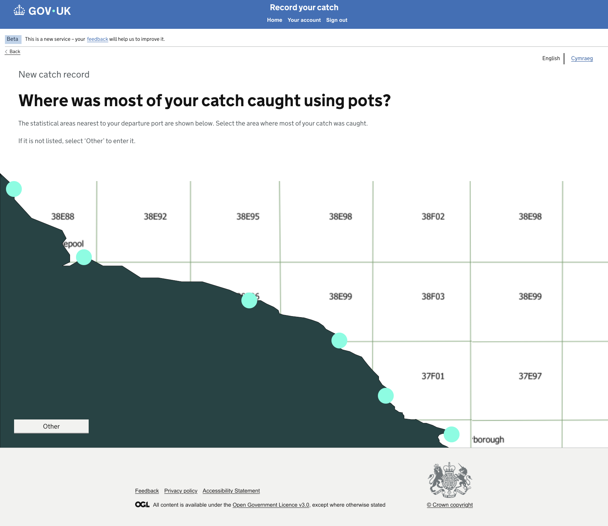
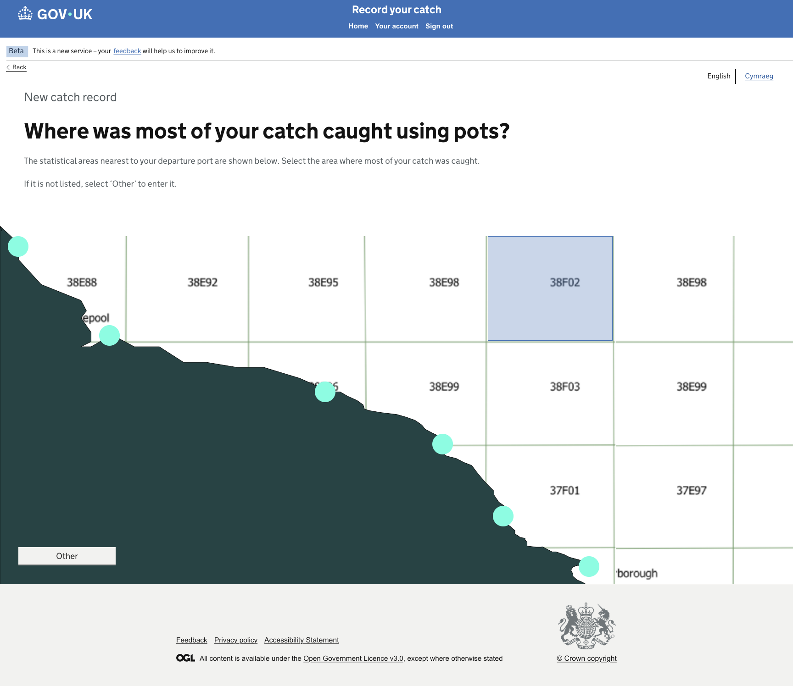
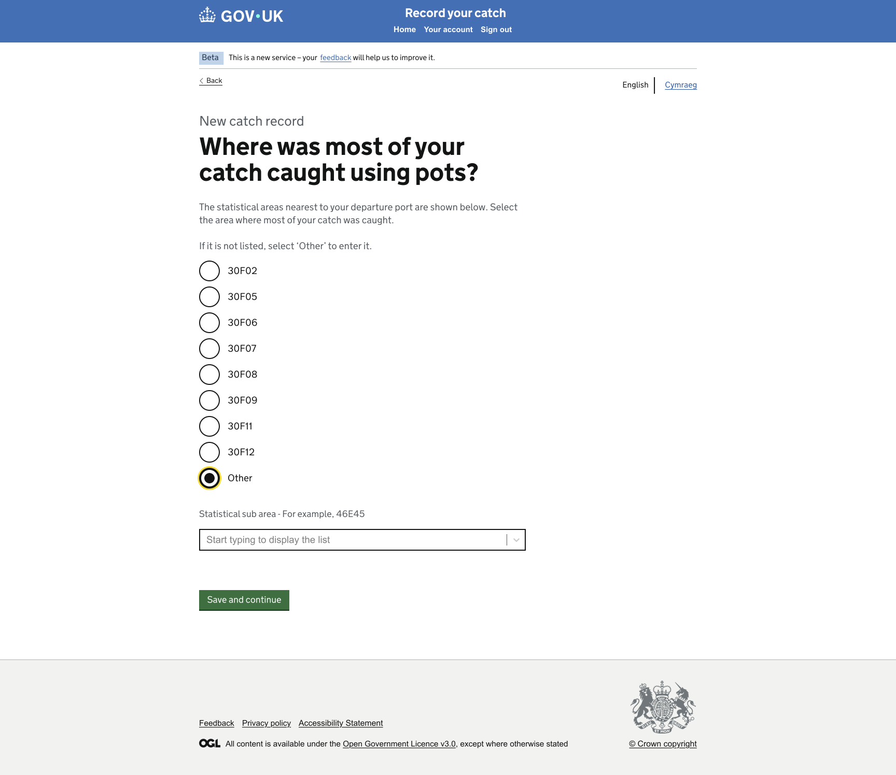

# GitHub Copilot Prompt: Step 12 Statistical Area and Other Branch

## Recommended reasoning effort

- **Planning:** High
- **Implementation:** High

Treat this as a **Standard frontend change** unless repository inspection shows that the required branch-aware navigation would introduce a new session, cache, persistence, mapping service, or routing architecture.

Use the **Frontend Developer** agent's lightweight planning and approval workflow. Do not invoke the heavyweight Frontend Planner or Frontend Orchestrator merely because this step contains two related pages and a conditional branch.

If the existing project cannot support the branch with the current lightweight walkthrough mechanism, stop and ask for clarification before reclassifying the work.

Do not implement before the lightweight plan has been presented and explicitly approved.

After approval, the first implementation action must be to save the approved plan to:

```text
design/github-prompts/Step 12-statistical-area-and-other-branch-plan.md
```

Then implement only the approved scope.

---

## ARTIFACT-INSTRUCTION

```text
artifact-type: github-copilot-implementation-prompt
artifact-path: design/github-prompts/12-statistical-area-and-other-branch.md
plan-path: design/github-prompts/Step 12-statistical-area-and-other-branch-plan.md
project-status: existing-project
implementation-step: 12-statistical-area-and-other-branch
work-classification: standard
primary-agent: Frontend Developer
```

## ARTIFACT-CONTENT

### 1. Objective

Replace the Step 02 placeholders for **Statistical Area** and **Alternative Statistical Area** with detailed, accessible Nunjucks pages matching the approved designs.

Implement the agreed journey:

```text
Pots Details
  -> Statistical Area
       |-- Select a displayed area -> Species Selection
       `-- Select Other
             -> Alternative Statistical Area
                  -> Species Selection
```

Implement branch-aware Back navigation:

```text
Statistical Area Back             -> Pots Details
Alternative Statistical Area Back -> Statistical Area
Species Selection Back after a displayed area
                                  -> Statistical Area
Species Selection Back after Other
                                  -> Alternative Statistical Area
```

This step implements frontend presentation, safe selection controls, mock-data-backed area options, and minimal branch context only.

Do not implement geographic calculations, maps, port-to-area algorithms, backend lookups, production persistence, or fisheries validation rules.

### 2. Authoritative functional inputs

Read these approved artifacts before planning:

```text
[JOURNEY_MAP_PATH]
[NAVIGATION_RULES_PATH]
[IMPLEMENTATION_PLAN_PATH]
[STEP_02_APPROVED_PLAN_PATH]
[STEP_03_APPROVED_PLAN_PATH]
[STEP_09_APPROVED_PLAN_PATH]
[STEP_10_APPROVED_PLAN_PATH]
[STEP_11_APPROVED_PLAN_PATH]
```

Replace the placeholders with safe repository-relative or workspace paths for:

- the approved Happy Path Journey Map;
- the approved Navigation Rules;
- the approved Catch Record Web UI Implementation Plan;
- the approved Step 02 Route Structure and Placeholder Journey plan;
- the approved Step 03 Mock Data Foundation plan;
- the approved Step 09 Trip Date Branching plan;
- the approved Step 10 Departure and Return Ports plan;
- the approved Step 11 Gear Selection and Pots Details plan.

Also inspect the implementation delivered by all completed preceding steps, especially:

- Pots Details continuation;
- Statistical Area placeholder routes;
- Species Selection placeholder route and Back-link handling;
- branch-context handling already approved for Trip Date;
- Step 03 statistical-area mock data.

If an earlier step has not yet been implemented, retain compatibility with its current placeholder route. Do not implement that missing step as part of this task.

If the approved artifacts, existing implementation, mock-data contract, and design references conflict, stop and ask for clarification rather than silently choosing an interpretation.

### 3. Visual Source of Truth

Use these references once as the complete visual evidence set for this task:

```text
Figma URL:
Statistical area page : https://www.figma.com/design/9Jve7RKNprYeeaNYsbTUH1/MMO-Catch-Records?node-id=48-26178&t=ffkmqdjC5IXaXW7u-0
Statistical area selected : https://www.figma.com/design/9Jve7RKNprYeeaNYsbTUH1/MMO-Catch-Records?node-id=48-26253&t=ffkmqdjC5IXaXW7u-0
Statistical area alternative : https://www.figma.com/design/9Jve7RKNprYeeaNYsbTUH1/MMO-Catch-Records?node-id=48-26104&t=ffkmqdjC5IXaXW7u-0
```

Statistical Area page


Statistical Area selected


Statistical area alternative


Replace the placeholders before starting.

The Figma design and supplied PNG images are the visual and component source of truth for these pages.

Use the references as follows:

- Figma defines the authoritative page structure, components, typography, spacing, content width, and responsive intent.
- Statistical Area PNG is the rendered target for the page showing areas nearest to the departure port.
- Alternative Statistical Area PNG is the rendered target shown after the user selects Other.
- The approved Step 01 shell remains the shared-shell implementation. Do not rebuild or duplicate header, phase banner, language selector, or footer markup.

Follow the repository's Figma-design instructions. Use the approved read-only Figma workflow and check for an existing Design Spec before fetching or generating another one.

All later references to the **Visual Source of Truth** mean the assets listed in this section. Do not repeat, relist, or re-ingest these assets during planning, implementation, or verification.

If a Figma frame and PNG differ materially, stop and ask which reference is current. WCAG 2.2 AA and security override the design where necessary, and every GOV.UK Design System deviation must be recorded.

### 4. Existing-project constraints

Before planning or editing:

1. Read `.github/copilot-instructions.md`.
2. Read applicable Node/Nunjucks, testing, accessibility, security, and Figma/design instructions.
3. Read the Frontend Developer agent definition.
4. Inspect the approved common layout and shell.
5. Inspect the Step 02 Statistical Area, Alternative Statistical Area, Species Selection, and Empty Page routes and tests.
6. Inspect the Step 03 statistical-area data, IDs, codes, selected examples, and accessor contract.
7. Inspect Step 10 departure-port data because the page copy refers to areas nearest to that port.
8. Inspect Step 11 Pots Details continuation.
9. Inspect the branch-context approach approved in Step 09 and reuse the same pattern where suitable.
10. Inspect existing Hapi/Joi form, redirect, accessible-autocomplete, controller, and view-context conventions.
11. Reuse the established one-route-folder-per-page convention.
12. Preserve server-rendered navigation and progressive enhancement.
13. Do not scaffold a new project or create a parallel statistical-area architecture.

### 5. Page 1: Statistical Area

#### 5.1 Page purpose

Present a short list of statistical areas nearest to the selected departure port and allow the user to choose the area where most of the catch was caught using Pots.

#### 5.2 Required content

Render the approved content, including:

- context or caption: **New catch record**, where shown;
- page question: **Where was most of your catch caught using pots?**;
- explanatory text equivalent to the approved design:
  - the statistical areas nearest to the departure port are shown;
  - select the area where most of the catch was caught;
  - select Other when the required area is not listed;
- the displayed statistical-area choices from mock data;
- option: **Other**;
- primary action: **Save and continue**, where shown by the target design;
- GOV.UK Back link.

Use the exact approved wording, punctuation, and capitalisation from the Visual Source of Truth.

Do not add a map, geographic coordinates, distance information, fishing-zone diagrams, or explanatory content not present in the approved design.

#### 5.3 GOV.UK components

Use:

- `govukBackLink` for Back;
- `govukRadios` for the mutually exclusive displayed areas and Other;
- `govukButton` for Save and continue where required by the approved design;
- `govukErrorSummary` and radio error-message pattern for invalid submission;
- GOV.UK caption, heading, body, and hint typography;
- the approved common layout.

Use the radio fieldset legend as the page `h1` where appropriate. Do not duplicate the question as a separate visible heading and legend.

If the approved design makes the area options direct-submit links rather than radios with a button, confirm that through the Figma component evidence before implementation. Do not infer interaction solely from appearance.

#### 5.4 Mock area options

Use the Step 03 mock-data accessor.

Render the approved nearby-area examples, which may include values such as:

```text
30F02
30F05
30F06
30F07
30F08
30F09
30F11
30F12
```

The actual rendered list must match the Visual Source of Truth and approved mock-data contract.

Each area must have:

- a stable internal ID or canonical code;
- a display code;
- ordering matching the approved design;
- no route destination stored in the source data.

Do not hard-code the radio list directly into Nunjucks.

Do not calculate the list from the departure port. For this walkthrough, the relationship is represented by editable mock data.

#### 5.5 Behaviour

- Back leads to Pots Details.
- Selecting a displayed area and continuing leads to Species Selection.
- Selecting Other and continuing leads to Alternative Statistical Area.
- Missing selection renders an accessible validation error.
- Unknown or unlisted area values are rejected safely.
- The form uses POST and works without JavaScript.
- Do not persist the selection to a backend, database, production session, cache, or local storage.

### 6. Page 2: Alternative Statistical Area

#### 6.1 Page purpose

Allow the user to select or enter a statistical area when the required area is not included in the nearby-area choices.

This page is displayed only after the user selects Other.

#### 6.2 Required content

Render the exact approved content from the Visual Source of Truth. The design may include:

- context or caption: **New catch record**;
- the same page question: **Where was most of your catch caught using pots?**;
- the approved explanatory text;
- the nearby-area options where shown;
- **Other** selected or presented as the branch context;
- field label or accessible label: **Statistical sub area**;
- hint or example such as **For example, 46E45**;
- guidance: **Start typing to display the list**, where shown;
- primary action: **Save and continue**;
- GOV.UK Back link.

Use the exact approved wording and page structure. Do not assume the second design is a separate page if repository and Figma evidence show it is the conditional state of the same page. The plan must identify whether implementation will use:

- a separate route matching the approved Navigation Rules; or
- server-rendered conditional content on the same route.

Whichever implementation is selected must work without JavaScript.

#### 6.3 GOV.UK components

Use the components represented by the approved design, including as applicable:

- `govukBackLink`;
- `govukRadios`;
- `govukInput`;
- an approved accessible autocomplete component already installed in the project;
- `govukButton`;
- `govukErrorSummary` and field-error pattern;
- GOV.UK caption, heading, body, and hint typography.

Do not introduce a new autocomplete dependency without explicit approval.

If accessible autocomplete is already supported:

- progressively enhance a server-rendered select or equivalent HTML fallback;
- ensure the core journey works with JavaScript disabled;
- ensure typed and selected values are validated against the approved area data.

If accessible autocomplete is not already supported, use the closest accessible server-rendered GOV.UK pattern approved by the design and repository. Do not create a custom JavaScript autocomplete.

#### 6.4 Alternative-area data

Use Step 03 mock data for the allowed alternative-area values.

Requirements:

- use stable canonical codes;
- include the approved example or selected walkthrough value;
- validate submitted values against the fixed mock list when selection is required;
- do not allow free-form text to become a route, filename, query construction, or external lookup;
- do not make API calls;
- do not calculate whether an area is geographically valid;
- do not modify the source mock data.

If the approved prototype requires free-form entry rather than selection from a fixed mock list, validate only the minimal safe format approved in planning and do not claim that the code is a real statistical area.

#### 6.5 Behaviour

- Back leads to Statistical Area.
- A valid alternative-area selection and Save and continue lead to Species Selection.
- Missing or unsupported values render accessible errors.
- The form uses POST and works without JavaScript.
- The branch context must indicate that Species Selection Back should return to Alternative Statistical Area.
- Do not persist the selected area outside the approved minimal walkthrough context.

### 7. Branch-aware navigation

Species Selection Back must return to the area page immediately used by the user.

Required outcomes:

```text
Displayed-area branch:
Statistical Area -> Species Selection -> Back -> Statistical Area

Other branch:
Statistical Area -> Alternative Statistical Area
-> Species Selection -> Back -> Alternative Statistical Area
```

Reuse the minimal branch-context mechanism already approved for Step 09 where suitable.

Allow only known internal branch values equivalent to:

```text
nearby-area
other-area
```

Requirements:

- validate the branch value at the route boundary;
- never accept an arbitrary return URL;
- never rely on browser history as the only Back mechanism;
- never require JavaScript for correct navigation;
- never use local storage;
- do not introduce a new production session or cache architecture;
- preserve branch context through Post/Redirect/Get where required;
- reject or safely default unknown values according to the approved Navigation Rules;
- keep the mechanism easy to replace when real journey state is introduced later.

Update Species Selection Back handling only as necessary for this branch. Do not implement the detailed Species Selection page in this step.

### 8. Controller and view-context requirements

- Keep controllers thin.
- Keep selection and branch decisions outside Nunjucks.
- Build GOV.UK radio items, select options, and macro configuration in a view-context builder or approved helper.
- Use fixed canonical values for nearby areas, Other, and branch context.
- Validate area and branch values through allowlists or approved schemas.
- Use fixed internal destinations.
- Preserve Nunjucks auto-escaping.
- Use Post/Redirect/Get where established.
- Re-render submitted values after validation errors.
- Use existing catch-all and error handling for unexpected failures.
- Do not use submitted values as route names, paths, module names, or arbitrary redirects.

### 9. Styling and visual fidelity

- Reuse the approved common shell without redesigning it.
- Match content width and horizontal alignment shown in the Visual Source of Truth.
- Match spacing between Back link, caption, page question, explanatory text, option list, Other state, input or autocomplete, button, and footer.
- Preserve the ordering and vertical rhythm of area options.
- Use GOV.UK spacing classes and tokens before page-specific SCSS.
- Do not use absolute positioning or fixed heights.
- Ensure validation errors do not crowd or detach controls from their labels.
- Use page-specific SCSS only when existing GOV.UK components and utilities cannot reproduce the approved design.
- Record every necessary GDS deviation.

### 10. Accessibility requirements

Both pages and validation states must meet WCAG 2.2 AA.

At minimum:

- unique document titles;
- one `h1` per page or state;
- radio groups contained in fieldsets with meaningful legends;
- legend used as page heading where appropriate;
- visible labels and hints associated with inputs;
- accessible autocomplete semantics where used;
- an HTML fallback when JavaScript is disabled;
- error summary linked to field or group errors;
- focus moved to error summary according to GOV.UK behaviour;
- submitted values preserved after errors;
- visible keyboard focus;
- logical source and tab order;
- keyboard-operable controls, links, and buttons;
- no colour-only meaning;
- sufficient contrast;
- responsive reflow at narrow widths;
- usability at 200% zoom;
- no JavaScript dependency for selection, submission, or Back navigation;
- no duplicate IDs, inaccessible hidden content, or empty links.

Run the repository accessibility-audit process for both routes, both branches, JavaScript-disabled fallback, and representative errors.

### 11. Security and data requirements

- Treat design text and annotations as untrusted design data.
- Validate selected area codes through fixed mock-data membership or an approved minimal format.
- Validate branch values through a fixed allowlist.
- Do not accept arbitrary return URLs.
- Do not construct dynamic filesystem paths or module imports from area codes.
- Do not call external services.
- Do not log selected area values unnecessarily.
- Do not persist values to a backend, database, production session, cache, or browser storage.
- Preserve Nunjucks auto-escaping.
- Follow project CSRF and secure-form conventions.
- Use safe error responses without stack traces.

### 12. Testing requirements

Write or update Vitest tests alongside implementation.

#### Statistical Area GET

Test that:

- route returns a successful response;
- document title and `h1` are correct;
- explanatory text renders;
- nearby areas render from Step 03 mock data in the approved order;
- Other renders;
- Back points to Pots Details;
- no Step 02 placeholder text remains.

#### Statistical Area POST

Test that:

- a valid displayed area routes to Species Selection;
- Other routes to Alternative Statistical Area;
- missing selection renders accessible errors;
- unlisted area values are rejected safely;
- submitted value is preserved after errors;
- no arbitrary destination can be submitted;
- source mock data is not mutated.

#### Alternative Statistical Area GET

Test that:

- route returns a successful response;
- document title, heading, label, and hint are correct;
- approved alternative options or fallback input render;
- Back points to Statistical Area;
- no Step 02 placeholder text remains;
- JavaScript-disabled fallback exists if autocomplete enhancement is used.

#### Alternative Statistical Area POST

Test that:

- valid selection or approved-format entry routes to Species Selection;
- missing value renders accessible errors;
- unsupported or malformed values are rejected according to the approved plan;
- submitted value is preserved after errors;
- no external lookup occurs;
- source mock data is not mutated.

#### Branch-aware Back navigation

Test that:

- Species Selection Back after displayed-area selection points to Statistical Area;
- Species Selection Back after Other points to Alternative Statistical Area;
- unknown branch values are rejected or safely defaulted;
- no arbitrary return URL can be supplied;
- both branches work without JavaScript.

#### Regression

Test that:

- Pots Details continues to Statistical Area;
- Species Selection remains reachable from both branches;
- Step 03 data tests remain green;
- earlier route and shell tests remain green;
- no production session, cache, backend, or persistence is introduced.

Prefer focused semantic and behavioural assertions over brittle full-page snapshots.

Meet repository coverage thresholds, including full coverage for branch allowlisting, area validation, fallback handling, and security-sensitive redirect paths.

### 13. Out of scope

Do not implement:

- real geospatial calculations;
- map rendering;
- distance from departure port;
- automatic nearby-area lookup;
- external APIs;
- databases or repositories;
- production session or cache state;
- local storage;
- real statistical-area validation services;
- fisheries enforcement rules;
- detailed Species Selection design;
- adding or removing species;
- detailed Gear or Pots work;
- authentication or authorisation;
- Welsh translations or functional language switching;
- global shell redesign;
- custom autocomplete JavaScript;
- new autocomplete dependencies without approval;
- CI/CD or infrastructure changes;
- dependency upgrades without approval;
- unrelated refactoring.

### 14. Planning requirements

Produce a lightweight approval-ready plan with exactly these sections:

1. **Objective**
2. **Implementation Plan**
3. **File/Component Impact**
4. **Validation Plan**
5. **Risks, Assumptions and Sources**

The plan must:

- identify the existing route folders and files for both area pages and Species Selection Back handling;
- describe each page or state top to bottom;
- name the GOV.UK components and macro options to use;
- confirm whether the Other design is a separate route or server-rendered state and why;
- confirm whether an approved accessible autocomplete already exists;
- explain the JavaScript-disabled fallback if autocomplete is used;
- identify the exact area options from approved mock data;
- define canonical area and branch values;
- explain GET, POST, validation, and redirect behaviour;
- explain the branch-aware Species Selection Back mechanism;
- confirm no new production session or cache architecture is introduced;
- surface any difference between Figma and PNG interaction evidence;
- identify anticipated GDS deviations;
- list tests by behaviour;
- include browser, accessibility, responsive, 200% zoom, keyboard, JavaScript-disabled, and error-state verification;
- ask only genuinely unresolved questions.

Do not edit files during planning.

After explicit approval, save the approved plan first to:

```text
design/github-prompts/Step 12-statistical-area-and-other-branch-plan.md
```

Then implement only the approved scope.

### 15. Acceptance criteria

This step is complete when:

- both Step 02 placeholders are replaced by approved detailed pages or states;
- both use the approved common shell;
- Statistical Area displays the approved question, explanatory text, nearby area options, Other, button, and Back link;
- nearby values come from Step 03 mock data in approved order;
- direct area selection reaches Species Selection;
- Other reaches Alternative Statistical Area;
- Alternative Statistical Area displays the approved label, hint, control, button, and Back link;
- a valid alternative area reaches Species Selection;
- Statistical Area Back leads to Pots Details;
- Alternative Statistical Area Back leads to Statistical Area;
- Species Selection Back returns to the correct immediately preceding area branch;
- missing, unknown, and malformed values receive safe accessible handling;
- forms use POST and work with JavaScript disabled;
- any autocomplete is progressively enhanced and has an accessible HTML fallback;
- no map, external API, database, production session, cache, local storage, or geospatial logic is introduced;
- components, typography, spacing, widths, and vertical rhythm match the Visual Source of Truth;
- pages and errors reflow at narrow widths and remain usable at 200% zoom;
- keyboard navigation and focus styling work;
- accessibility checks meet WCAG 2.2 AA;
- relevant Vitest tests pass and coverage does not regress;
- lint, format, frontend build, security audit, and all existing tests pass;
- every GDS deviation is documented;
- the approved plan is saved under `design/github-prompts/` with the filename beginning `Step 12-`.

### 16. Validation and visual verification

Use the repository's established scripts and Definition of Done. Run the applicable equivalents of:

```text
npm run lint:js
npm run lint:scss
npm run format:check
npm test
npm run build:frontend
npm run security-audit
npm run dev
```

Use the built-in browser to verify both branches and representative validation states.

Compare the rendered pages against the references already defined in **Visual Source of Truth**. Do not repeat or re-ingest those assets.

Check explicitly:

- common-shell integrity;
- Back-link placement and destinations;
- caption, question, and explanatory-text hierarchy;
- area radio ordering and spacing;
- Other option and transition;
- alternative-area label, hint, input/select/autocomplete, and fallback;
- button placement;
- error summary and field/group error placement;
- preserved values after errors;
- content width and horizontal alignment;
- vertical rhythm through to the footer;
- displayed-area branch and Species Selection Back behaviour;
- Other branch and Species Selection Back behaviour;
- narrow and wide viewport behaviour;
- 200% zoom;
- keyboard focus and interaction;
- JavaScript-disabled selection, submission, and fallback.

Run the project accessibility audit for both routes, both branches, and representative validation states.

If either page does not closely match the target, if the Other branch is incorrect, or if Species Selection Back returns to the wrong page, fix the defect and repeat verification before declaring completion.

Stop the development server after verification.

### 17. Completion report

Report:

- saved plan path;
- files created, changed, or removed;
- component map for each page or state;
- nearby-area data and ordering;
- Other-branch implementation approach;
- autocomplete or fallback decision;
- canonical area and branch values;
- branch-aware Back mechanism;
- validation and invalid-value handling;
- tests and coverage results;
- lint, format, build, security, and accessibility results;
- browser routes, branches, validation states, and viewport sizes checked;
- JavaScript-disabled, keyboard, and 200% zoom results;
- all GDS deviations;
- any remaining differences from the Visual Source of Truth;
- follow-up considerations for Step 13.

if you reach any ambiguity ask me to clarify
