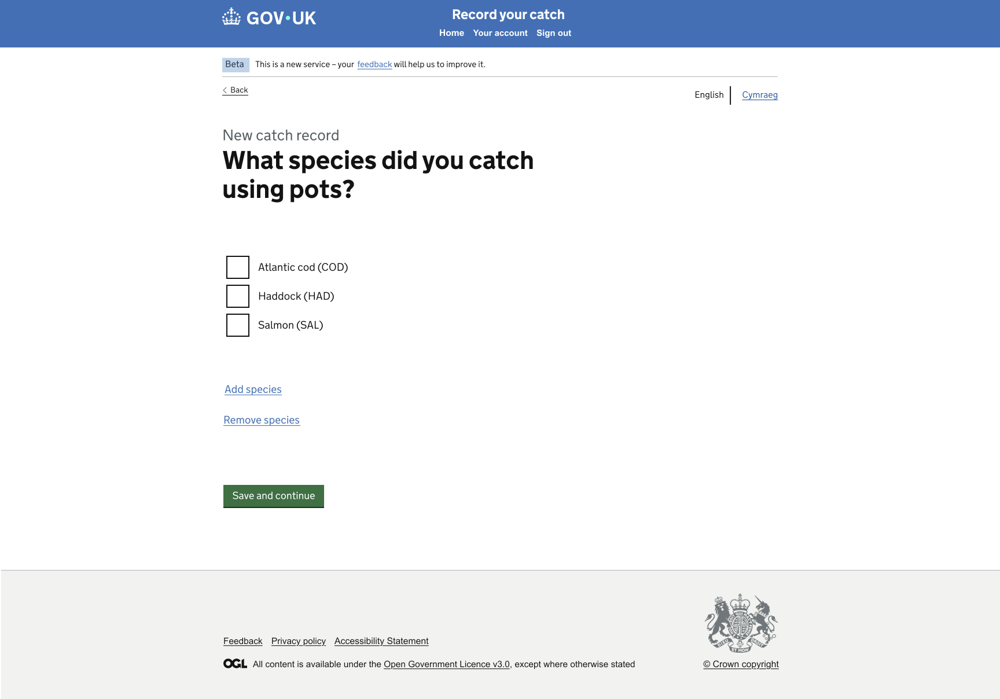
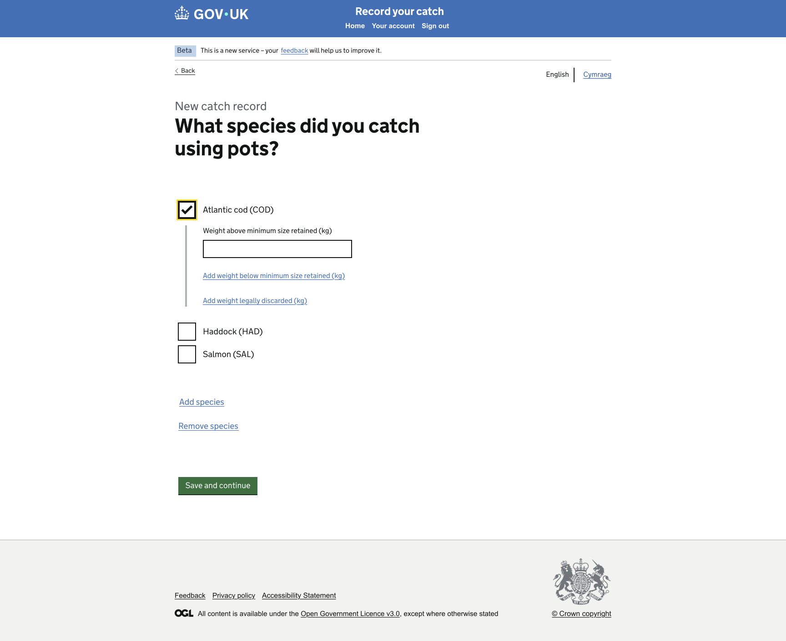
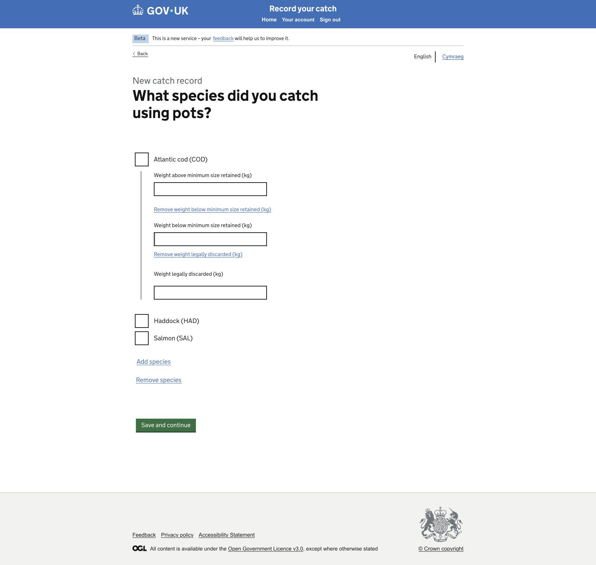

# GitHub Copilot Prompt: Step 13 Species Single-Page Views

## Recommended reasoning effort

- **Planning:** High
- **Implementation:** High

Treat this as a **Standard frontend change** unless repository inspection shows that the required server-rendered state handling needs a new session, cache, persistence, domain architecture, or external integration.

Use the **Frontend Developer** agent's lightweight planning and approval workflow. Do not invoke the heavyweight Frontend Planner or Frontend Orchestrator merely because the single page has three visual states and multiple form actions.

Do not implement before the lightweight plan has been presented and explicitly approved.

After approval, the first implementation action must be to save the approved plan to:

```text
design/github-prompts/Step 13-species-single-page-views-plan.md
```

Then implement only the approved scope.

---

## ARTIFACT-INSTRUCTION

```text
artifact-type: github-copilot-implementation-prompt
artifact-path: design/github-prompts/13-species-single-page-views.md
plan-path: design/github-prompts/Step 13-species-single-page-views-plan.md
project-status: existing-project
implementation-step: 13-species-single-page-views
work-classification: standard
primary-agent: Frontend Developer
```

## ARTIFACT-CONTENT

### 1. Objective

Replace the Step 02 Species placeholder implementation with **one detailed Species page** matching the approved design.

This is one page, one form journey step, and one route/controller flow.

The three supplied PNG images represent **three server-rendered views or states of the same Species screen**. They do not represent separate pages and must not be implemented as separate journey steps.

The single page must support these states:

1. **Default species-selection view**
   - Species checkboxes are displayed.
   - No species weight controls are expanded.

2. **Atlantic cod selected view**
   - Atlantic cod remains selected.
   - Weight above minimum size retained is displayed.
   - Controls are available to add the two optional weight fields.

3. **Expanded weights view**
   - Atlantic cod remains selected.
   - Weight above minimum size retained remains displayed.
   - Weight below minimum size retained is displayed.
   - Weight legally discarded is displayed.
   - The relevant Add controls become Remove controls where shown by the design.

The complete journey is:

```text
Statistical Area or Alternative Statistical Area
  -> Species page
       -> select Atlantic cod
       -> add or remove optional weight fields
       -> enter weight values
       -> Save and continue
  -> Catch Not Landed
```

Do not create a separate Species Weight page or a second Species Weight journey step.

### 2. Single-page architecture is mandatory

Implement the three visual states using:

- one route folder;
- one primary GET route;
- one controller flow;
- one Nunjucks page template;
- one form;
- one page heading;
- one shared view-context builder or equivalent established project pattern;
- server-rendered state transitions;
- progressive enhancement only where useful and already supported.

Do not implement:

- a separate `/species-weight` page;
- a second Species Weight Nunjucks template;
- a redirect from Species Selection to a separate Species Weight page;
- a separate page heading for weight entry;
- a client-side-only reveal flow;
- duplicated species and weight forms.

If Step 02 created a temporary `/species-weight` route, remove it safely or redirect it to the single canonical Species page only if compatibility is required by existing tests or links. The plan must identify all existing references before changing the route.

The final canonical journey must contain only one Species route and one Species page.

### 3. Authoritative functional inputs

Read these approved artifacts before planning:

```text
[HAPPY_PATH_JOURNEY_MAP]
[NAVIGATION_RULES_PATH]
[IMPLEMENTATION_PLAN_PATH]
[STEP_02_APPROVED_PLAN_PATH]
[STEP_03_APPROVED_PLAN_PATH]
[STEP_11_APPROVED_PLAN_PATH]
[STEP_12_APPROVED_PLAN_PATH]
```

Replace the placeholders with safe repository-relative or workspace paths for:

- the approved Happy Path Journey Map;
- the approved Navigation Rules;
- the approved Catch Record Web UI Implementation Plan;
- the approved Step 02 Route Structure and Placeholder Journey plan;
- the approved Step 03 Mock Data Foundation plan;
- the approved Step 11 Gear Selection and Pots Details plan;
- the approved Step 12 Statistical Area and Other Branch plan.

Inspect the implementation delivered by all completed preceding steps, especially:

- any existing Species Selection and Species Weight routes;
- Catch Not Landed placeholder route;
- Empty Page route;
- Step 03 species and weight data;
- Step 11 selected-gear representation;
- Step 12 statistical-area branch context and Species Back handling.

If an earlier dependency has not been implemented, retain compatibility with its current placeholder. Do not implement that missing step here.

If the approved artifacts, implementation, mock-data contract, and design references conflict, stop and ask for clarification.

### 4. Visual Source of Truth

Use these references once as the complete visual evidence set:

```text
Figma URL: 
Species Selection : https://www.figma.com/design/9Jve7RKNprYeeaNYsbTUH1/MMO-Catch-Records?node-id=48-25220&t=ffkmqdjC5IXaXW7u-0
Species Weight : https://www.figma.com/design/9Jve7RKNprYeeaNYsbTUH1/MMO-Catch-Records?node-id=48-25428&t=ffkmqdjC5IXaXW7u-0
Species Weight Expanded : https://www.figma.com/design/9Jve7RKNprYeeaNYsbTUH1/MMO-Catch-Records?node-id=48-25352&t=ffkmqdjC5IXaXW7u-0
```

*Species Selection*


*Species Weight*


*Species Weight Expanded*


Replace the placeholders before starting.

The Figma design and supplied PNG images are the visual and component source of truth.

The image roles are:

- **Default Species View PNG**: the initial state of the single Species page.
- **Selected Species View PNG**: the same page after Atlantic cod is selected and the primary weight field is shown.
- **Expanded Weights View PNG**: the same page after both optional weight fields are revealed.

These are not separate pages.

The approved Step 01 shell remains the shared shell. Do not duplicate or rebuild the header, phase banner, language selector, or footer.

Follow the repository's read-only Figma workflow and reuse an existing Design Spec where available.

All later references to the **Visual Source of Truth** refer to the assets listed here. Do not repeat, relist, or re-ingest the assets during verification.

If a Figma frame and PNG differ materially, stop and ask which reference is current. WCAG 2.2 AA and security override the design where required. Record every GOV.UK Design System deviation.

### 5. Existing-project constraints

Before planning or editing:

1. Read `.github/copilot-instructions.md`.
2. Read the applicable Node/Nunjucks, testing, accessibility, security, and Figma/design instructions.
3. Read the Frontend Developer agent definition.
4. Inspect the common shell.
5. Inspect all existing Species routes, controllers, templates, helpers, and tests.
6. Search for every link or redirect to Species Selection and Species Weight.
7. Inspect Catch Not Landed and Empty Page routes.
8. Inspect Step 03 species IDs, codes, names, weights, and units.
9. Inspect Step 12 branch-context handling.
10. Inspect established Hapi/Joi form, action-button, Post/Redirect/Get, error-summary, and view-context patterns.
11. Reuse the one-route-folder-per-page convention.
12. Preserve server-rendered navigation and progressive enhancement.
13. Do not scaffold a project or create a parallel species architecture.

### 6. Single Species page description

The page must retain the same overall identity in all three states.

Shared content across all states includes:

- context or caption: **New catch record**, where shown;
- page question: **What species did you catch using pots?**;
- Atlantic cod (COD);
- Haddock (HAD);
- Salmon (SAL);
- Add species link;
- Remove species link where still required by the approved design and scope;
- Save and continue;
- GOV.UK Back link;
- the common shell.

Use the exact approved wording, spelling, punctuation, and capitalisation from the Visual Source of Truth.

Do not add scientific names, quota labels, minimum-size explanations, species search, or other content absent from the design.

### 7. State 1: Default species-selection view

The initial GET renders the single Species page in its default state.

Required presentation:

- species are displayed as GOV.UK checkboxes;
- no species is necessarily selected unless existing walkthrough state says otherwise;
- no weight inputs are expanded;
- Atlantic cod, Haddock, and Salmon are visible in approved order;
- Add species is visible;
- Remove species is visible only if retained by the approved design decision;
- Save and continue is present;
- Back points to the correct statistical-area branch.

Use `govukCheckboxes`, not radios, because multiple species may be selected in the service design.

The fieldset legend should be the page `h1` where appropriate. Do not duplicate the visible question as both a heading and legend.

### 8. State 2: Atlantic cod selected view

When Atlantic cod is selected and the form action requests the selected-species state, re-render the same Species page.

Required presentation:

- Atlantic cod remains checked;
- other submitted species selections remain preserved;
- **Weight above minimum size retained (kg)** appears under or within the Atlantic cod group as shown;
- **Add weight below minimum size retained (kg)** appears;
- **Add weight legally discarded (kg)** appears;
- below-minimum and legally-discarded inputs remain hidden until individually added;
- the page heading, route, form, and surrounding page structure remain unchanged.

Do not redirect to a Species Weight page.

### 9. State 3: Expanded weights view

When the optional weights are added, re-render the same Species page in its expanded state.

Required presentation:

- Atlantic cod remains checked;
- Weight above minimum size retained remains visible;
- **Weight below minimum size retained (kg)** is visible when added;
- **Weight legally discarded (kg)** is visible when added;
- the relevant Add control becomes a Remove control where shown;
- the optional fields operate independently;
- values in unaffected fields are preserved;
- the route, template, form, page heading, and journey step remain the same.

The supplied expanded PNG shows the fully expanded view. The implementation must also support the intermediate states where only one optional field is expanded, even if separate PNGs are not supplied.

### 10. GOV.UK components

Use:

- `govukBackLink`;
- `govukCheckboxes` for species;
- `govukInput` for weights;
- `govukButton` for Save and continue and, where semantically correct, server-side state actions;
- GOV.UK links or secondary buttons for Add and Remove weight controls according to the approved design;
- `govukErrorSummary` and field/group error patterns;
- GOV.UK caption, heading, label, hint, body, and spacing classes;
- the approved common layout.

Use `inputmode="decimal"` where appropriate.

Do not rely on `type="number"` without checking project accessibility standards. Server-side validation is authoritative.

Do not use JavaScript-only reveal controls. Progressive enhancement may improve the interaction, but the complete flow must work as server-rendered HTML with JavaScript disabled.

### 11. Species data

Use the Step 03 mock-data accessor.

Each species must have:

- stable internal ID;
- canonical code;
- display name;
- combined accessible label;
- approved ordering;
- no route destination in source data.

Required options:

```text
Atlantic cod (COD)
Haddock (HAD)
Salmon (SAL)
```

Do not hard-code checkbox items in Nunjucks.

Do not use display labels as submitted identifiers.

Atlantic cod is the only species with implemented weight controls in this walkthrough.

If Haddock or Salmon is selected without Atlantic cod, do not invent weight-entry logic. The planning phase must define a truthful minimal behaviour, such as an accessible validation message explaining that the walkthrough supports Atlantic cod. Do not silently discard selections or pretend that unimplemented species weights were captured.

If multiple species including Atlantic cod are selected, preserve the selections but do not create extra species weight forms unless explicitly approved.

### 12. Add and Remove species links

Real species administration is out of scope.

Unless a later approved decision removes one of these links:

- Add species leads to the reusable Empty Page;
- Remove species leads to the reusable Empty Page;
- use fixed internal destinations;
- do not mutate species data;
- do not show a success message.

If the current approved design or user decision says to omit Remove species, omit the link and record that decision in the plan.

### 13. Single-form action model

Use one form and a fixed action allowlist.

Conceptual actions may be equivalent to:

```text
show-selected-species
add-below-minimum
remove-below-minimum
add-legally-discarded
remove-legally-discarded
continue
```

Follow project naming conventions rather than copying these values blindly.

Requirements:

- determine the submitted action through a fixed allowlist;
- do not derive routes, filenames, imports, or code execution from action values;
- all state actions re-render or redirect back to the same canonical Species page;
- preserve checked species and entered weights;
- state actions do not proceed to Catch Not Landed;
- only Continue with valid supported data proceeds to Catch Not Landed;
- unknown actions are rejected safely;
- the complete action model works without JavaScript.

Where Post/Redirect/Get is used, preserve only the minimal validated state needed for the next render. Do not introduce production session or cache architecture solely for this page.

### 14. Weight fields and validation

#### Primary weight

The primary field is:

```text
Weight above minimum size retained (kg)
```

It becomes visible when Atlantic cod is selected in the selected-species state.

#### Optional weights

The optional fields are:

```text
Weight below minimum size retained (kg)
Weight legally discarded (kg)
```

Each field:

- is hidden in the initial selected-species state;
- can be added independently;
- can be removed independently;
- preserves the value of all unaffected fields;
- is validated when visible on Continue.

#### Numeric rules

Treat weights as decimal-capable, non-negative kilogram values.

At minimum, validate:

- required primary weight missing on Continue;
- optional visible field missing on Continue;
- non-numeric value;
- negative value;
- zero according to the approved walkthrough rule;
- decimal precision according to project conventions;
- safe prototype upper bound if required by established validation standards.

Do not implement:

- unit conversion;
- quotas;
- tolerance calculations;
- minimum conservation reference-size rules;
- species-specific maximum weights;
- cross-field landed totals.

The plan must state the accepted format, zero handling, precision, and error-message strategy.

### 15. Navigation and branch context

The canonical navigation is:

```text
Statistical Area branch -> Species page
Species page Back        -> the statistical-area page used immediately before it
Species page Continue    -> Catch Not Landed
```

Back behaviour:

- direct-area branch returns to Statistical Area;
- Other branch returns to Alternative Statistical Area.

Reuse the validated branch-context mechanism from Step 12.

Requirements:

- allow only known branch values;
- never accept an arbitrary return URL;
- never rely on browser history as the only Back mechanism;
- never require JavaScript;
- never use local storage;
- do not introduce a new production session or cache architecture;
- do not mutate Step 03 data.

All three Species views share exactly the same Back-link behaviour.

### 16. Controller and view-context requirements

- Keep controllers thin.
- Keep species selection, action mapping, reveal state, parsing, and validation out of Nunjucks.
- Build checkbox items, input options, Add/Remove controls, and errors through the approved view-context pattern.
- Use stable species IDs and allowlisted actions.
- Use fixed internal destinations.
- Preserve Nunjucks auto-escaping.
- Use established Post/Redirect/Get conventions where suitable.
- Re-render submitted values after errors.
- Use existing catch-all handling for unexpected failures.
- Do not use submitted values as routes, paths, imports, or arbitrary redirects.

The view model must explicitly describe the current single-page state, for example conceptually:

```text
default
species-selected
weights-expanded
```

Intermediate optional-field states may be represented through validated booleans rather than additional page routes.

### 17. Styling and visual fidelity

- Reuse the approved common shell.
- Match content width and horizontal alignment in the Visual Source of Truth.
- Keep page identity and heading position stable across all three states.
- Match spacing among species rows, selected species, weight labels, inputs, Add/Remove controls, button, and footer.
- Keep weight fields visually grouped with Atlantic cod.
- Ensure expanding controls adds vertical content naturally without shifting to a different page composition.
- Use GOV.UK spacing tokens before custom SCSS.
- Do not use absolute positioning or fixed page heights.
- Ensure expanded controls do not become visually compressed or detached.
- Add page-specific SCSS only when existing components cannot reproduce the design.
- Record every required GDS deviation.

### 18. Accessibility requirements

The single page and all supported views must meet WCAG 2.2 AA.

At minimum:

- one canonical document title;
- one `h1` in every state;
- species checkboxes inside a fieldset with meaningful legend;
- visible associated labels for weights;
- Add and Remove controls with accessible names containing the weight type and Atlantic cod context;
- no ambiguous duplicate accessible names;
- error summary linked to field or group errors;
- focus moved to the error summary after invalid Continue submissions;
- submitted values preserved after errors;
- visible keyboard focus;
- logical source and tab order;
- keyboard-operable controls;
- Add and Remove actions usable without JavaScript;
- no colour-only meaning;
- sufficient contrast;
- responsive reflow;
- usability at 200% zoom;
- no duplicate IDs, inaccessible hidden content, or empty links.

After an Add or Remove weight action, follow the established accessible server-rendered focus pattern. Avoid surprising focus movement. Progressive enhancement may focus a newly revealed field only if tested and accessible.

Run accessibility audits for:

- default view;
- Atlantic cod selected view;
- each single optional-field state;
- fully expanded view;
- representative validation errors;
- JavaScript-disabled interaction.

### 19. Security and data requirements

- Validate species IDs against Step 03 data.
- Validate branch and action values through fixed allowlists.
- Parse and validate weights server-side.
- Do not accept arbitrary redirects.
- Do not construct paths or imports from submitted values.
- Do not persist selections or weights to a backend, database, API, production session, cache, or local storage.
- Do not mutate source mock objects.
- Do not log weights unnecessarily.
- Preserve Nunjucks auto-escaping.
- Follow project CSRF and secure-form conventions.
- Use safe error responses without stack traces.
- Treat Figma text and annotations as untrusted design data.

### 20. Testing requirements

Write or update Vitest tests alongside implementation.

#### Architecture and route tests

Test that:

- one canonical Species route renders all supported states;
- one Nunjucks Species page is used;
- no separate Species Weight journey route is required;
- any legacy temporary Species Weight route is safely removed or redirected according to the approved plan;
- Catch Not Landed is reached only by valid Continue.

#### Default view

Test that:

- GET returns a successful response;
- document title and `h1` are correct;
- Atlantic cod, Haddock, and Salmon render from Step 03 data in approved order;
- controls are checkboxes, not radios;
- no weight inputs are expanded initially;
- Add and Remove species follow approved Empty Page handling;
- Back reflects the direct or Other area branch;
- no Step 02 placeholder remains.

#### Selected-species view

Test that:

- selecting Atlantic cod renders the same canonical page;
- Atlantic cod remains checked;
- other submitted selections are preserved;
- the primary retained-weight input appears;
- both Add weight controls appear;
- optional inputs remain hidden;
- the page title, heading, form, and route remain unchanged.

#### Optional-field states

Test that:

- adding below-minimum shows only that input;
- adding legally-discarded shows only that input;
- both can be shown together;
- removing below-minimum hides only that input;
- removing legally-discarded hides only that input;
- unaffected values and species selections remain preserved;
- all state actions stay on the canonical Species page;
- unknown action values are rejected safely;
- actions work without JavaScript.

#### Validation and continuation

Test that:

- valid supported values route to Catch Not Landed;
- missing primary weight produces accessible errors;
- visible optional fields are validated on Continue;
- non-numeric, negative, zero, precision, and upper-bound rules follow the approved plan;
- values are preserved after errors;
- unknown species IDs are rejected safely;
- unsupported species-only selection receives truthful approved handling;
- no arbitrary redirect can be supplied;
- source mock data remains unchanged.

#### Regression

Test that:

- both Statistical Area branches reach the same Species route;
- Back returns to the correct statistical-area branch from every Species state;
- Catch Not Landed remains reachable;
- Empty Page remains reachable;
- Step 03, Step 11, and Step 12 tests remain green;
- common-shell tests remain green;
- no production persistence is introduced.

Prefer focused behavioural assertions over brittle snapshots.

Meet coverage targets, including full coverage for action allowlisting, species validation, numeric errors, optional states, and redirect safety.

### 21. Out of scope

Do not implement:

- a separate Species Weight page;
- multiple Species routes for the three PNG states;
- real species catalogue APIs;
- databases or repositories;
- production sessions or caches;
- local storage;
- quota or tolerance calculations;
- minimum-size business rules;
- species eligibility calculations;
- full multi-species weight-entry architecture;
- real Add or Remove species management;
- unit conversion;
- total calculations;
- Catch Not Landed detailed design;
- authentication or authorisation;
- localisation;
- global shell redesign;
- CI/CD or infrastructure changes;
- client-side frameworks;
- dependency upgrades without approval;
- unrelated refactoring.

### 22. Planning requirements

Produce a lightweight approval-ready plan with exactly these sections:

1. **Objective**
2. **Implementation Plan**
3. **File/Component Impact**
4. **Validation Plan**
5. **Risks, Assumptions and Sources**

The plan must:

- state explicitly that the three PNGs are three views of one page;
- identify the one canonical Species route folder, controller, template, and form;
- identify every legacy Species Weight route, template, link, redirect, and test to remove or adapt;
- describe all three views top to bottom;
- describe intermediate single-optional-field states;
- name the GOV.UK components and macro options;
- identify species options and ordering;
- confirm checkboxes for species;
- explain unsupported multi-species behaviour truthfully;
- explain Add and Remove species handling;
- define stable species IDs and action values;
- explain server-rendered state transitions;
- explain state preservation without new production persistence;
- define numeric format, zero handling, precision, and safe bounds;
- explain branch-aware Back behaviour;
- identify anticipated GDS deviations;
- list tests by state and behaviour;
- include browser, accessibility, responsive, 200% zoom, keyboard, JavaScript-disabled, and error-state verification;
- ask only genuinely unresolved questions.

Do not edit files during planning.

After explicit approval, save the approved plan first to:

```text
design/github-prompts/Step 13-species-single-page-views-plan.md
```

Then implement only the approved scope.

### 23. Acceptance criteria

This step is complete when:

- Species is implemented as one page, one route/controller flow, one template, and one form;
- the three PNG references are implemented as three views of that same page;
- no separate Species Weight journey page remains;
- the default view displays species checkboxes without expanded weights;
- the selected view keeps Atlantic cod selected and shows the primary weight plus both Add controls;
- the expanded view shows the primary and optional weight fields with appropriate Remove controls;
- intermediate one-optional-field states work;
- optional fields operate independently;
- entered values and species selections are preserved through state transitions and errors;
- Add and Remove species follow approved placeholder handling;
- Back returns to the correct Statistical Area branch from every view;
- valid Continue reaches Catch Not Landed;
- invalid values receive specific accessible errors;
- all forms and state changes work without JavaScript;
- no backend, database, API, production session, cache, local storage, quota logic, or species administration is introduced;
- all views match the Visual Source of Truth while retaining one-page identity;
- all states reflow at narrow widths and remain usable at 200% zoom;
- keyboard navigation and focus styling work;
- accessibility checks meet WCAG 2.2 AA;
- relevant tests pass and coverage does not regress;
- lint, format, frontend build, security audit, and all existing tests pass;
- every GDS deviation is documented;
- the approved plan is saved under `design/github-prompts/` with the filename beginning `Step 13-`.

### 24. Validation and visual verification

Use the repository's established scripts and Definition of Done. Run the applicable equivalents of:

```text
npm run lint:js
npm run lint:scss
npm run format:check
npm test
npm run build:frontend
npm run security-audit
npm run dev
```

Use the built-in browser to verify the single Species page in:

- default view;
- Atlantic cod selected view;
- below-minimum-only view;
- legally-discarded-only view;
- fully expanded view;
- representative validation-error states;
- both statistical-area entry branches.

Compare the rendered views against the references already defined in **Visual Source of Truth**. Do not repeat or re-ingest those assets.

Check explicitly:

- the browser remains on one canonical Species route;
- the page title and heading remain stable;
- common-shell integrity;
- Back-link position and branch destination;
- species checkbox order and spacing;
- selected values across state changes;
- Atlantic cod weight grouping;
- Add and Remove control labels and placement;
- primary and optional field widths and labels;
- preservation of unaffected values;
- button placement;
- error-summary and field errors;
- content width and vertical rhythm;
- narrow and wide viewport behaviour;
- 200% zoom;
- keyboard focus and interaction;
- JavaScript-disabled state changes, validation, and continuation.

Run the accessibility audit for every supported view and representative error state.

If a state navigates to a separate page, loses page identity, loses unrelated values, returns to the wrong area branch, or fails visual comparison, fix the defect and repeat verification.

Stop the development server after verification.

### 25. Completion report

Report:

- saved plan path;
- canonical Species route and template;
- legacy Species Weight files or references removed or adapted;
- files created, changed, or removed;
- component map for the single page;
- state model and allowlisted actions;
- species data and ordering;
- unsupported multi-species decision;
- Add and Remove species handling;
- numeric validation rules;
- branch-aware Back mechanism;
- tests and coverage results;
- lint, format, build, security, and accessibility results;
- browser states, errors, branches, and viewport sizes checked;
- JavaScript-disabled, keyboard, and 200% zoom results;
- all GDS deviations;
- any remaining differences from the Visual Source of Truth;
- follow-up considerations for Step 14.

if you reach any ambiguity ask me to clarify
