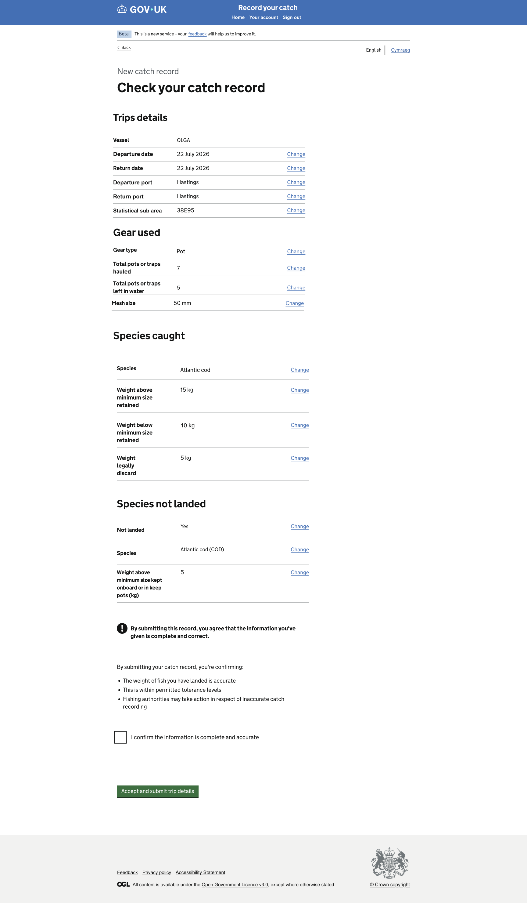

# Step 15: Check Your Answers

## ARTIFACT-INSTRUCTION

Use safe repository-relative paths and kebab-case filenames for implementation files. Do not use absolute paths or paths containing `..`.

Store this GitHub Copilot prompt at:

```text
design/github-prompts/Step 15-check-your-answers.md
```

After the implementation plan is approved, the first implementation action must be to save the approved plan using the same prompt name at:

```text
design/github-prompts/Step 15-check-your-answers-plan.md
```

Do not implement before the plan is approved and saved.

## ARTIFACT-CONTENT

## 1. Title

Catch Record Web UI: Step 15 - Implement Check Your Answers

## 2. Agent Workflow

Use only the agents required for this task.

### Planning

**Agent:** `.github/agents/frontend-planner.agent.md`

**Thinking effort:** High

The planning agent must:

1. Inspect the repository, all preceding approved plans, and the current Catch Record journey state.
2. Inspect every supplied Check Your Answers PNG carefully.
3. Transcribe all visible headings, section titles, labels, values, links, declaration text, hints, warnings and button text exactly from the PNG.
4. Map each displayed value to the existing editable JSON journey-state object.
5. Identify every Change link and its explicit destination.
6. Define how the user returns to Check Your Answers after changing an answer.
7. Identify how incomplete, unavailable or inconsistent journey data is handled.
8. Define declaration validation and the handoff to the submission step.
9. Identify exact files to create or modify.
10. Define unit, route, integration, responsive and accessibility testing.
11. Record only genuine ambiguities that affect implementation.
12. Produce the implementation plan and stop for approval.

After approval, the first action must be to save the plan at:

```text
design/github-prompts/Step 15-check-your-answers-plan.md
```

### Implementation

**Agent:** `.github/agents/frontend-developer.agent.md`

**Thinking effort:** High

High implementation effort is recommended because this page aggregates the full journey state, contains multiple edit loops, requires accessible summary markup, and hands off to submission.

The implementation agent must:

1. Read the approved saved plan.
2. Implement only the approved Step 15 scope.
3. Reuse existing journey-state, routing, validation, localisation and shared-layout patterns.
4. Derive displayed answers from existing editable JSON state and reference-data objects.
5. Add or update focused tests.
6. Run the relevant checks and report the results.

### Review

**Agent:** `.github/agents/frontend-code-reviewer.agent.md`

**Thinking effort:** High

The reviewer must assess:

- Fidelity to the supplied PNG
- Completeness and correctness of displayed answers
- Change-link destinations and return behaviour
- Declaration and validation behaviour
- Submission handoff
- GDS component usage
- Accessibility
- Responsive layout
- Security and data exposure
- Test quality
- Regression risk and scope control

Classify findings as:

```text
Blocking
Important
Suggestion
```

### Orchestrator

Do not use `.github/agents/frontend-orchestrator.agent.md`. This is a contained frontend journey capability. Use the orchestrator only if repository inspection proves that independent technical domains require coordination, and document that evidence before using it.

## 3. Objective

Implement the Check Your Answers page for the Catch Record happy path.

The page must allow the user to:

1. Review all answers collected in the current catch-record journey.
2. Identify each group of information clearly.
3. Use a Change link to return to the relevant page.
4. Change an answer and return to Check Your Answers with the updated value shown.
5. Read and complete the declaration or confirmation shown in the PNG.
6. Continue to the existing submission step only when all required review-page conditions are satisfied.

## 4. Background Context

Catch Recording is a frontend-only application with no backend or database.

All dummy reference data and journey data must remain in editable JSON object files using the existing repository pattern. Do not add a backend, database, remote API or hidden hard-coded data source.

This page aggregates data captured in preceding steps, including only the sections and values shown in the supplied Check Your Answers PNG. The following submission and confirmation behaviour belongs to the next approved step unless an existing submission action only needs to be invoked by this page.

Reuse the existing shared header, centred main menu, white middle logo dot, phase banner, Back link region, English/Cymraeg selector and footer with its thin grey top border. Do not redesign shared components.

## 5. Visual Sources of Truth

### Check Your Answers Figma URL

```text
https://www.figma.com/design/9Jve7RKNprYeeaNYsbTUH1/MMO-Catch-Records?node-id=48-25761&t=NUg9uxzWWs0SP7ND-0
```

### Check Your Answers PNG



The supplied PNG or PNG sequence is authoritative for visible wording, displayed sections, row order, labels, value formatting, Change links, declaration text, component positioning and spacing.

Use this precedence:

1. Supplied PNG images for visible UI content and presentation.
2. Explicit functional and technical constraints in this prompt.
3. Approved implementation plan and existing application architecture.
4. Figma URL for supplementary visual detail.
5. Journey documentation for route context.
6. GOV.UK Design System guidance where the design does not resolve a detail.

Do not replace PNG wording with alternative wording from this prompt, prior prompts or journey documentation. If a conflict affects behaviour rather than presentation, ask for clarification.

## 6. Critical Constraints

1. Implement only Check Your Answers and its direct edit and submission handoff behaviour.
2. Do not implement the final submission service or confirmation page unless an existing route only needs to be called.
3. Do not redesign any preceding data-entry page.
4. Do not redesign the shared shell.
5. Do not add a backend, database or remote API.
6. Do not invent summary sections, rows, labels, values, declaration text or warnings.
7. Do not display rows not shown in the PNG merely because journey state contains extra properties.
8. Do not omit rows shown in the PNG when valid source data exists.
9. Do not copy display labels into journey state when an existing stable ID and reference-data lookup are available.
10. Do not derive business logic in Nunjucks templates.
11. Do not hard-code answer values in templates or controllers.
12. Do not use browser history for Back or Change navigation.
13. Do not clear valid journey state when a Change link is used.
14. Do not submit automatically when the page is opened.
15. Do not allow submission if a required declaration shown in the PNG has not been completed.
16. Do not introduce new dependencies.
17. Do not refactor unrelated code.
18. Preserve all earlier visual corrections and completed journey behaviour.

## 7. Required Outcome

After this task:

1. The approved previous step navigates to Check Your Answers.
2. The page matches the supplied PNG or PNG sequence.
3. All required review sections appear in the correct order.
4. Every displayed answer is sourced from the current catch-record journey state or approved reference-data JSON.
5. Values are formatted consistently with the PNG.
6. Every Change link has a unique accessible name and explicit destination.
7. Changing an answer returns the user to Check Your Answers through the existing journey return mechanism.
8. Updated answers appear immediately after returning.
9. Required declaration or confirmation input is validated accessibly.
10. A valid submission action passes control to the approved submission route.
11. Missing or inconsistent required data is not silently displayed as valid.
12. Relevant tests pass.
13. The page meets WCAG 2.2 AA requirements.

## 8. Scope

### In scope

- Check Your Answers GET route
- Check Your Answers POST route if declaration or submission handoff requires it
- Controller or handler
- Review-page view-model mapper
- Nunjucks template
- GOV.UK Summary List sections shown in the PNG
- Conditional rows shown by the design and existing state
- Value formatting
- Change links and return-to-review behaviour
- Declaration, confirmation or acknowledgement shown in the PNG
- Error Summary and inline error for required review-page input
- Existing journey-state and editable JSON reference-data integration
- Direct handoff to the approved submission route
- Unit, route, rendering, integration and accessibility tests
- Responsive verification

### Out of scope

- New capture fields
- Redesigning prior steps
- Account management
- Backend persistence
- Remote APIs
- Final confirmation-page implementation
- New submission infrastructure
- Email or notification delivery
- PDF generation
- Full Welsh translation infrastructure
- Shared shell changes
- Business rules not supported by the PNG or approved requirements

## 9. Inspect Before Planning

Inspect:

```text
.github/copilot-instructions.md
.github/instructions/
.github/skills/
design/github-prompts/
src/
test-helpers/
package.json
```

Locate and report:

1. The current Catch Record journey-state shape.
2. Every preceding page route that must be targeted by a Change link.
3. The mechanism used to return to a calling review page after an edit.
4. Existing Summary List macros or wrappers.
5. Existing formatting helpers for dates, times, ports, gear, areas, species, weights and optional answers.
6. Existing reference-data JSON files.
7. Existing conditional-section rules.
8. Existing Error Summary and checkbox validation patterns.
9. Existing submission route or placeholder dependency.
10. Existing localisation utilities.
11. Existing route, rendering, integration and accessibility tests.
12. Any mismatch between the PNG and available journey data.

Do not assume filenames or state-property names.

## 10. Journey Flow

Implement the approved equivalent of:

```text
Previous completed catch-record step
  -> Check Your Answers
     -> Change a specific answer
        -> relevant existing data-entry page
           -> save valid change
              -> Check Your Answers
     -> complete required declaration
        -> submit or continue
           -> approved submission route
```

### Back link

The Check Your Answers Back link must use the explicit route shown by the approved journey and existing implementation. It must not use browser history.

### Change links

Each Change link must:

1. Target the exact page responsible for the displayed answer.
2. Preserve the current draft-record context.
3. Carry or establish the existing return-to-review context safely.
4. Return to Check Your Answers after a valid update rather than continuing through the full remaining journey, when that is the approved project pattern.
5. Avoid open-redirect behaviour.
6. Avoid relying on client-side history.

If an existing page cannot yet return to Check Your Answers, update only the minimal shared return-navigation mechanism approved in the plan. Do not redesign the whole journey.

## 11. Page and Section Requirements

Implement the exact sections, headings, row labels and order shown in the PNG.

For each section, the planning agent must record:

- Visible section heading
- Source journey-state properties
- Required reference-data lookup
- Display-formatting rule
- Change-link destination
- Change-link accessible name
- Whether the row or section is conditional
- Behaviour for missing source data

Do not presume section names. Typical catch-record topics may include vessel, trip, ports, skipper, gear, pots, statistical area, species, landed weights or not-landed catch, but render only what the PNG requires.

### Summary lists

Use separate GOV.UK Summary List components or the existing project wrapper for each visual section shown in the PNG.

Requirements:

1. Preserve the PNG's section and row order.
2. Use semantic keys and values.
3. Put Change links in the actions column when shown.
4. Make each Change link accessible name unique, for example by including visually hidden context using the project pattern.
5. Do not render empty rows.
6. Do not display raw stable IDs.
7. Do not display `undefined`, `null`, empty arrays, JSON or internal property names.
8. Follow the PNG for how multiple values are separated or listed.

### Declaration or confirmation

Use the exact component shown in the PNG.

If the PNG shows a checkbox:

- Use the GOV.UK Checkboxes component with one item or the established single-checkbox pattern.
- Associate the visible declaration text correctly.
- Validate that it is checked before submission.

If the PNG shows warning text, use the GOV.UK Warning Text component and exact wording.

If the PNG shows only informational text and no user control, do not invent a checkbox.

### Primary action

Use the exact label and component shown in the PNG.

The action must invoke only the existing or approved submission handoff. Do not implement final confirmation UI in this step.

## 12. GDS Components

Use components according to the PNG and existing project patterns.

Expected components may include:

- GOV.UK Back Link through the shared shell
- GOV.UK Heading
- GOV.UK Summary List
- GOV.UK Warning Text, only if shown
- GOV.UK Checkboxes or other declaration control, only if shown
- GOV.UK Button
- GOV.UK Error Summary
- GOV.UK inline Error Message
- GOV.UK body text and links

Do not substitute cards, tables or custom grids for Summary Lists unless the PNG explicitly requires a different component.

## 13. Positioning and Spacing

Match the PNG using GOV.UK spacing tokens and existing project utilities.

Requirements:

1. Use the shared width container.
2. Keep the Back link and English/Cymraeg controls in the shared pre-main region.
3. Align the page heading and review content with the main content grid.
4. Use the content width shown in the PNG. Do not force a two-thirds width when the Summary Lists require the wider container shown by the design.
5. Place each section heading immediately above its Summary List.
6. Use consistent spacing between sections.
7. Align Change actions consistently.
8. Place declaration or warning content after the review sections in the exact PNG order.
9. Place the primary action beneath the declaration or final explanatory content.
10. Place Error Summary before the page heading.
11. Do not use absolute positioning.
12. Do not create empty elements for spacing.
13. Allow keys, values and actions to stack according to GOV.UK responsive Summary List behaviour.
14. Keep the footer in normal document flow.
15. Preserve the existing logo, centred menu and thin grey footer border.

The plan must identify the exact GOV.UK macros, classes and spacing utilities used.

## 14. View-Model Requirements

Create or reuse a dedicated review-page mapper so the Nunjucks template receives presentation-ready data.

The mapper should provide the approved equivalent of:

```text
pageTitle
backLink
sections
  heading
  rows
    key
    formattedValue
    changeHref
    changeAccessibleContext
declaration
primaryAction
errors
```

Use existing naming conventions.

Requirements:

1. Keep domain and formatting logic out of Nunjucks.
2. Resolve stable IDs through approved editable JSON reference data.
3. Format dates, times, quantities and multiple values consistently.
4. Preserve exact visible labels from the PNG.
5. Use safe text or structured Nunjucks content rather than constructing untrusted HTML.
6. Include only sections and rows required by the design.
7. Handle optional data through explicit approved rules.
8. Treat required missing data as an incomplete or error condition, not a successful blank answer.

## 15. Data and Formatting Requirements

Use existing editable JSON reference-data files and journey state.

Do not duplicate port, gear, species, area or other reference data merely for this page.

The planning agent must define formatting for every visible value, including where applicable:

- Dates
- Times
- Combined departure and return information
- Port names
- Vessel labels
- Gear selections
- Pots details
- Statistical areas
- Species names
- Weight values and units
- Yes or No answers
- Lists of multiple selections
- Optional or not-applicable answers

Follow the PNG exactly for visible format. Do not invent punctuation, units or fallback wording.

## 16. Missing and Conditional Data

For every row, define whether the value is:

- Required
- Optional
- Conditional on an earlier answer
- Not applicable for the current journey branch

Requirements:

1. Do not render sections irrelevant to the completed branch unless shown in the PNG.
2. Do not render stale pots data when current gear no longer requires it.
3. Do not render stale conditional answers from abandoned branches.
4. Do not silently treat missing required data as complete.
5. Use existing incomplete-journey handling where available.
6. If the design specifies fallback text such as `Not provided`, use it exactly and only for the approved rows.
7. If required source data cannot be mapped, block submission and expose an appropriate user-safe route or error based on the approved plan.

## 17. Declaration and Validation

Implement only validation required on Check Your Answers.

If the PNG contains a required declaration control:

1. Validate that the required value is selected.
2. Display an Error Summary and inline error on failure.
3. Link the summary error to the control.
4. Preserve the submitted state where safe.
5. Use PNG error wording when supplied.
6. Otherwise use existing repository wording conventions and record the exact wording in the plan.
7. Follow the existing invalid-form HTTP status convention, preferably `400` where already established.

Before handoff to submission, also verify that the current draft has the required completed journey data using existing business rules. Do not invent a second, conflicting completeness model.

## 18. Submission Handoff

The valid primary action must:

1. Preserve the current catch-record identifier or context.
2. Pass control to the existing or approved submission route.
3. Avoid duplicate submission caused by using a GET request for a state-changing action.
4. Preserve existing CSRF protection for POST actions.
5. Prevent submission when declaration validation fails.
6. Prevent submission when existing completeness checks fail.
7. Avoid implementing the confirmation page in this step.

If the submission route does not yet exist, planning must identify the exact dependency and the approved incremental placeholder approach. Do not invent a hidden successful submission.

## 19. Error Handling and Security

1. Preserve existing authentication and authorisation.
2. Handle missing or invalid draft context through existing patterns.
3. Do not silently create a new draft.
4. Do not expose internal IDs, JSON paths, stack traces or raw state.
5. Escape dynamic display values through normal Nunjucks behaviour.
6. Build Change URLs with existing safe internal route helpers.
7. Do not accept arbitrary return URLs from untrusted query parameters.
8. Allow only approved internal return destinations.
9. Preserve existing CSRF protection.
10. Do not log sensitive journey data.
11. Do not treat reference-data lookup failure as a valid blank value.
12. Prevent duplicate or repeated state-changing submission according to existing project conventions.

## 20. Accessibility

Meet WCAG 2.2 AA and repository accessibility instructions.

Verify:

1. The page has a unique browser title.
2. The page has one clear primary heading.
3. Section headings follow a logical hierarchy.
4. Summary List markup preserves meaningful key-value relationships.
5. Every Change link has a unique accessible name that identifies the answer being changed.
6. Visually hidden context does not duplicate or confuse visible text.
7. Declaration labels and errors are associated programmatically.
8. Error Summary links focus the declaration control or relevant target.
9. Keyboard focus order follows the page order.
10. Focus indicators remain visible.
11. The page works without client-side JavaScript where practical.
12. Summary rows reflow at 320 CSS pixels without inappropriate horizontal scrolling.
13. The page works at 200% and 400% zoom.
14. Information is not conveyed by colour or position alone.
15. English/Cymraeg metadata continues through the shared shell.
16. Dynamic updates after returning from a Change route produce a normal page load with a meaningful heading and title.

Use `.github/skills/web-accessibility-audit/` during implementation or review.

## 21. Responsive Requirements

Validate at:

```text
320px
768px
1024px
1440px
```

Confirm:

- Long keys, values and Change actions do not overlap
- Multi-line values remain readable
- Summary List rows stack according to GOV.UK behaviour
- No inappropriate horizontal scroll appears
- Declaration and error content reflow correctly
- Primary action remains visible and usable
- Shared Back and language controls do not overlap
- Footer remains in normal flow
- Spacing and content width match the PNG at the reference viewport

## 22. Testing Requirements

Follow existing testing instructions and use `.github/skills/unit-tests/` where relevant.

### View-model tests

Cover:

1. Every required PNG section is produced in the correct order.
2. Every required row is produced in the correct order.
3. Stable IDs resolve to the correct visible labels.
4. Dates, times, values, units and lists use approved formatting.
5. Conditional rows appear only for the relevant branch.
6. Stale branch data is excluded.
7. Change URLs target the correct route.
8. Change accessible context is unique and correct.
9. Required missing data is not mapped as a successful blank answer.
10. No internal ID or raw JSON is exposed as a visible value.

### Route and controller tests

Cover:

1. GET renders Check Your Answers for a complete draft.
2. GET supplies the expected page title, Back link and sections.
3. Missing draft context follows existing error behaviour.
4. Incomplete required data follows the approved behaviour.
5. Invalid declaration POST returns accessible errors.
6. Valid declaration POST hands off to the approved submission route.
7. The submission action preserves draft context.
8. Existing authentication and authorisation remain enforced.

### Template tests

Cover:

1. Visible wording matches the PNG.
2. Correct Summary List semantics are rendered.
3. Section and row order matches the PNG.
4. Every Change link appears once with unique accessible context.
5. The correct declaration or confirmation component is rendered.
6. No unapproved row, section or control appears.
7. Error Summary is absent on initial valid GET.
8. Errors appear correctly on invalid POST.
9. Shared language selector is not duplicated.
10. Shared shell corrections remain intact.

### Change-loop integration tests

Cover representative routes for each review section:

```text
Check Your Answers
  -> Change answer
  -> valid update
  -> Check Your Answers
  -> updated value displayed
```

Test every distinct destination or at least every destination type according to existing project testing standards. Ensure return-to-review context cannot redirect outside approved internal routes.

### Submission-handoff integration test

Cover:

```text
Complete journey state
  -> Check Your Answers
  -> complete declaration
  -> submit
  -> approved submission route
```

Also test the invalid declaration path.

### Accessibility tests

Run automated accessibility checks for:

- Complete review page
- Page with long or multiple values
- Declaration error state
- Conditional-section variants supported by the journey

Do not rely only on snapshots. Assert semantic structure and behaviour explicitly.

## 23. Documentation

If this step introduces a review mapper or return-to-review mechanism, document briefly:

- Review-page view-model structure
- Reference-data resolution
- Value-formatting helpers
- How Change routes return to review safely
- Conditional-row rules
- Declaration validation
- Submission handoff
- Relevant tests

Do not duplicate general GOV.UK guidance.

## 24. Suggested Files to Modify

The planning agent must identify actual files. Likely areas include:

- Catch Record route configuration
- Check Your Answers controller or handler
- Review-page view-model mapper
- Check Your Answers Nunjucks template
- Existing formatting helpers, only if required
- Existing journey return-navigation helper, only if required
- Minimal updates to preceding routes for safe return-to-review behaviour
- Route and controller tests
- Mapper and template tests
- Integration and accessibility tests
- Minimal developer documentation

Do not duplicate existing editable JSON data. Modify other files only when necessary and explain why.

## 25. Delivery Plan Rules

Before implementation, the planning agent must produce:

1. Repository findings.
2. Exact PNG transcription.
3. Section-by-section and row-by-row mapping.
4. Source state and reference-data mapping.
5. Formatting rules.
6. Conditional-row rules.
7. Change-link destinations and safe return behaviour.
8. Declaration and validation behaviour.
9. Submission-handoff design.
10. GDS component mapping.
11. Positioning and spacing plan.
12. Exact files to create or modify.
13. Unit, route, integration and accessibility test plan.
14. Risks, dependencies and genuine ambiguities.
15. Confirmation that the orchestrator is not required.

Do not modify code during planning. Stop and wait for approval.

After approval, the first action must be to save the approved plan as:

```text
design/github-prompts/Step 15-check-your-answers-plan.md
```

Then implement only the approved plan.

At completion, report:

- Files changed
- Review sections and mappings implemented
- Change loops implemented
- Declaration and validation implemented
- Submission handoff implemented
- Tests and results
- Accessibility checks and results
- Manual verification completed
- Any approved-plan deviation and reason

## 26. Manual Verification

1. Start the application using the documented command.
2. Complete the preceding happy-path steps with known test values.
3. Navigate to Check Your Answers.
4. Compare the complete page with every supplied PNG.
5. Verify each section title, row label, value, unit and order.
6. Verify every Change link has clear visible and accessible context.
7. Use each Change link and confirm the correct page opens with saved data restored.
8. Save each representative change and confirm return to Check Your Answers.
9. Confirm updated values are displayed.
10. Confirm unrelated values remain unchanged.
11. Verify conditional sections for all supported happy-path branches.
12. Confirm stale conditional data is not shown.
13. Submit without completing the required declaration and verify accessible errors, if a declaration control is shown.
14. Complete the declaration and activate the primary action.
15. Confirm handoff to the approved submission route.
16. Verify the Back link destination.
17. Switch English/Cymraeg through the existing mechanism and confirm page and state are preserved.
18. Test keyboard-only navigation.
19. Test 320px, 768px, 1024px and 1440px widths.
20. Test 200% and, where practical, 400% zoom.
21. Confirm no browser-console errors.
22. Confirm the logo, centred menu and thin grey footer border remain unchanged.

## 27. Acceptance Criteria

- [ ] The approved plan is saved as `design/github-prompts/Step 15-check-your-answers-plan.md` before implementation.
- [ ] Check Your Answers matches the supplied PNG sequence.
- [ ] Visible wording and presentation follow the PNG where documentation differs.
- [ ] All required sections and rows appear in the correct order.
- [ ] Displayed values come from existing journey state and reference-data JSON.
- [ ] Raw IDs, raw JSON, `undefined` and `null` are never shown.
- [ ] Conditional sections reflect the current valid journey branch.
- [ ] Stale branch data is not displayed.
- [ ] Every Change link has the correct explicit destination and unique accessible name.
- [ ] Valid changes return to Check Your Answers with updated values.
- [ ] Required declaration validation is accessible.
- [ ] Valid completion hands off to the approved submission route.
- [ ] No backend, database or remote API is introduced.
- [ ] No final confirmation page is implemented prematurely.
- [ ] Shared layout and prior journey behaviour remain unchanged.
- [ ] Unit, route, integration and accessibility tests pass.
- [ ] No unrelated changes or dependencies are included.

## 28. Quality Requirements

- Follow existing Node.js, Nunjucks, routing and test conventions.
- Reuse GOV.UK components and existing wrappers.
- Keep mapping, formatting and conditional logic out of templates.
- Reuse editable JSON reference data rather than duplicating it.
- Use safe internal URLs for review edit loops.
- Use semantic HTML and logical heading structure.
- Use GOV.UK spacing tokens rather than arbitrary values.
- Preserve progressive enhancement.
- Keep tests behaviour-focused.
- Avoid overengineering and unapproved business rules.

## 29. Final Instruction

if you reach any ambiguity ask me to clarify
