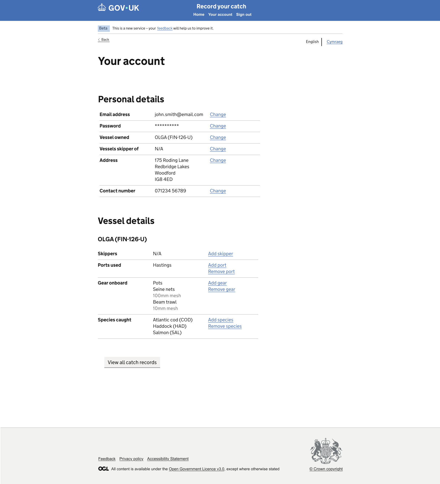

# Step 17: Account Page and Header Destinations

## ARTIFACT-INSTRUCTION

Use safe repository-relative paths and kebab-case filenames for implementation files. Do not use absolute paths or paths containing `..`.

Store this GitHub Copilot prompt at:

```text
design/github-prompts/Step 17-account-page-header-destinations.md
```

After the implementation plan is approved, the first implementation action must be to save the approved plan using the same step name at:

```text
design/github-prompts/Step 17-account-page-header-destinations-plan.md
```

Do not implement before the plan is approved and saved.

## ARTIFACT-CONTENT

## 1. Title

Catch Record Web UI: Step 17 - Implement the Account Page and Header Destinations

## 2. Agent Workflow

Use only the agents required for this task.

### Planning

**Agent:** `.github/agents/frontend-planner.agent.md`

**Thinking effort:** High

The planning agent must:

1. Inspect the repository, approved preceding plans, current shared header, current authentication simulation, routing conventions, editable JSON data, and tests.
2. Inspect every supplied Account page and header-reference PNG carefully.
3. Transcribe all visible Account page wording, headings, labels, links, values, controls, and section order exactly from the PNG.
4. Identify the exact intended destinations for the header links shown by the design, including Home, Your account, and Sign out.
5. Confirm which header links appear for signed-in and signed-out states using existing requirements and supplied images.
6. Define explicit server-side route behaviour for every header destination.
7. Define the Account page view model and its source data.
8. Define sign-out state-clearing and redirect behaviour without adding a real authentication provider.
9. Identify exact files to create or modify.
10. Define unit, route, integration, responsive, security, and accessibility testing.
11. Record only genuine ambiguities that affect behaviour.
12. Produce the implementation plan and stop for approval.

After approval, the first action must be to save the plan at:

```text
design/github-prompts/Step 17-account-page-header-destinations-plan.md
```

### Implementation

**Agent:** `.github/agents/frontend-developer.agent.md`

**Thinking effort:** Medium

Use High thinking effort only if repository inspection reveals that the header destinations require substantial changes to existing authentication/session architecture or route guards.

The implementation agent must:

1. Read the approved saved plan.
2. Implement only the approved Step 17 scope.
3. Reuse the existing common application shell and header component.
4. Use the existing editable JSON object and journey-state patterns.
5. Add or update focused tests.
6. Run the relevant checks and report the results.

### Review

**Agent:** `.github/agents/frontend-code-reviewer.agent.md`

**Thinking effort:** Medium

The reviewer must assess:

- Fidelity to the supplied Account page PNG
- Correct header-link destinations
- Signed-in and signed-out header states
- Sign-out safety and state clearing
- Reuse of shared components
- GDS component selection
- Accessibility
- Responsive behaviour
- Security and privacy
- Test quality
- Regression risk and scope control

Classify findings as:

```text
Blocking
Important
Suggestion
```

### Orchestrator

Do not use `.github/agents/frontend-orchestrator.agent.md`. The Account page and shared-header destinations form one contained frontend task and normally require only the planner, developer, and reviewer agents.

Use the orchestrator only if repository inspection proves that multiple independent technical domains require coordination. Document that evidence before using it.

## 3. Objective

Implement the Account page and make the shared header destinations functional.

The task must provide explicit and accessible destinations for the header navigation shown in the supplied design, including:

- Home
- Your account
- Sign out

The Account page must render the exact content and actions shown in the attached PNG. Header links must use explicit internal routes, preserve the existing header layout, and behave consistently across the application.

## 4. Background Context

Catch Recording is currently a frontend-only application with no production backend or database.

Dummy account, vessel, and journey data must remain in editable JSON object files or the existing repository state mechanism. Do not introduce a backend, database, remote API, identity provider, or real account-management service.

The common application shell already contains the service header and menu. Previous corrections established that:

- The existing logo must remain its current size.
- The middle dot in the logo must remain white.
- The main menu must remain centred inside the blue header area.
- The footer must retain its thin grey top border.

This step makes the existing header destinations functional and implements the Account page without redesigning the common shell.

## 5. Visual Sources of Truth

### Account Page Figma URL

```text
https://www.figma.com/design/9Jve7RKNprYeeaNYsbTUH1/MMO-Catch-Records?node-id=48-24646&t=NUg9uxzWWs0SP7ND-0
```

### Account Page PNG



### Header PNG


The supplied PNG for each visual area is authoritative for visible wording, labels, menu order, link text, page content, component order, positioning, and spacing.

Use this precedence:

1. Supplied PNG images for visible UI content and presentation.
2. Explicit functional and technical constraints in this prompt.
3. Approved implementation plan and existing application architecture.
4. Figma URLs for supplementary visual detail.
5. Journey documentation for route context.
6. GOV.UK Design System guidance where the design does not resolve a detail.

Do not replace PNG wording with alternative wording from this prompt or previous documentation. Ask only where a conflict affects functionality and cannot be resolved from the repository or images.

## 6. Critical Constraints

1. Implement only the Account page and header destinations included in this prompt.
2. Do not redesign the header, menu, logo, phase banner, language selector, Back link region, or footer.
3. Do not change the logo size or white middle dot.
4. Do not move the centred main menu away from the centre of the blue header area.
5. Do not change menu labels, order, typography, or spacing away from the PNG.
6. Do not change the thin grey footer top border.
7. Do not add a production backend, database, remote API, or identity provider.
8. Do not implement real password management, registration, email delivery, or identity verification.
9. Do not expose sensitive account data in the Account page, HTML, client-side state, logs, or URLs.
10. Do not hard-code account values directly in Nunjucks templates.
11. Do not use browser history for Home, Your account, Sign out, or Back navigation.
12. Do not use a GET request for state-changing sign-out behaviour if the existing application and security conventions require POST.
13. Do not invent Account page sections, values, actions, or links not shown in the PNG.
14. Do not implement vessel, skipper, ports, gear, or species management unless the Account page PNG explicitly exposes those destinations and this prompt approves only the destination links.
15. Do not implement the target management journeys in this step unless they already exist.
16. Do not introduce new dependencies.
17. Do not refactor unrelated code.
18. Preserve Catch Record journey state unless the explicit approved sign-out rule requires clearing it.

## 7. Required Outcome

After this task:

1. The shared header continues to match its PNG and previous visual corrections.
2. Home navigates to the approved service landing destination.
3. Your account navigates to the Account page.
4. Sign out performs the approved simulated sign-out behaviour and redirects to the approved signed-out destination.
5. The Account page matches its supplied PNG.
6. Account content comes from the existing editable JSON object or approved frontend state source.
7. Header link visibility reflects the approved signed-in and signed-out states.
8. The current page is identified accessibly in navigation where the design and current component pattern support it.
9. Account-page links use explicit internal destinations.
10. Missing or invalid account context uses existing error handling.
11. Relevant tests pass.
12. The implementation meets WCAG 2.2 AA expectations.

## 8. Scope

### In scope

- Account page GET route
- Account page controller or handler
- Account page view-model mapping
- Account page Nunjucks template
- Home header destination
- Your account header destination
- Sign-out route and safe frontend-only state clearing
- Signed-in and signed-out header-menu states
- Active/current navigation state where supported by the design and existing component
- Editable JSON account data integration
- Explicit Account page action destinations shown in the PNG
- Route guards using the existing simulated authentication mechanism
- Unit, route, rendering, integration, security, and accessibility tests
- Responsive verification

### Out of scope

- Real authentication or GOV.UK One Login integration
- Password changes
- Account registration
- Email verification
- User-data updates unless the PNG explicitly shows an existing editable form and it is separately approved
- Backend persistence
- Database changes
- Remote APIs
- Implementing new vessel, skipper, port, gear, or species management journeys
- Redesigning the service home page
- Redesigning the shared header or footer
- Full Welsh translation infrastructure
- Catch Record feature changes

## 9. Inspect Before Planning

Inspect:

```text
.github/copilot-instructions.md
.github/instructions/
.github/skills/
design/github-prompts/
src/
test-helpers/
package.json
```

Locate and report:

1. The shared header and main-menu component.
2. Existing route names and hrefs for Home, Your account, and Sign out.
3. Existing signed-in state or simulated authentication mechanism.
4. Existing sign-in and signed-out routes.
5. Existing session or frontend state-clearing helpers.
6. The approved Home destination.
7. Existing account routes, templates, data objects, or fixtures.
8. Existing current-navigation or active-link pattern.
9. Existing account-level management routes linked from the design.
10. Existing localisation utilities.
11. Existing security and CSRF conventions.
12. Existing route, template, integration, and accessibility tests.
13. Any discrepancy between the header PNG, Account PNG, and current implementation.

Do not assume filenames, route names, or state-property names.

## 10. Header Destination Rules

### 10.1 Home

The Home link must:

1. Use the exact visible label shown in the header PNG.
2. Link to the approved service home or records landing page discovered from the existing journey.
3. Use an explicit internal route generated according to repository conventions.
4. Avoid resetting the user's account or catch-record state merely by navigating Home.
5. Preserve normal keyboard and focus behaviour.
6. Use current-page semantics only when Home is the active destination and the existing navigation component supports them.

Do not infer that Home means the public GOV.UK homepage. Follow the existing service architecture and approved design.

### 10.2 Your account

The Your account link must:

1. Use the exact label shown in the header PNG.
2. Navigate explicitly to the Step 17 Account page.
3. Preserve the approved signed-in context.
4. Use current-page semantics on the Account page where supported.
5. Not expose account identifiers in the visible URL unless that is already the approved safe route pattern.

### 10.3 Sign out

The Sign out control must:

1. Use the exact visible label and presentation shown in the header PNG.
2. Use the existing project security convention for state-changing actions.
3. Clear only the approved simulated authentication and sensitive user journey state.
4. Redirect to the approved signed-out destination.
5. Prevent access to signed-in-only pages after sign-out through the existing route guard.
6. Avoid open redirects.
7. Avoid exposing tokens or state in the URL.
8. Work without client-side JavaScript where practical.

The planning agent must explicitly define which state is cleared and which non-sensitive editable reference data remains.

Do not silently delete persisted code fixtures or modify source JSON account-reference files during sign-out.

## 11. Header Presentation Requirements

Reuse the existing shared header. Do not create an Account-specific copy.

Requirements:

1. Keep the existing logo dimensions and position.
2. Keep the logo middle dot white.
3. Keep the main menu horizontally centred relative to the full blue header area.
4. Preserve menu order shown in the PNG.
5. Preserve existing menu-item spacing, typography, focus, hover, and visited-state behaviour.
6. Prevent menu overlap with the logo or other header controls.
7. Preserve existing responsive menu behaviour.
8. Do not use arbitrary offsets, negative margins, or absolute positioning to distinguish the current page.
9. Use semantic navigation markup and an accessible label.
10. Do not include the contextual Back link inside the header.

## 12. Account Page Requirements

Implement exactly the visible Account page content shown in the PNG.

The planning agent must record for every visible element:

- Exact heading or label
- Component type
- Data source
- Display formatting
- Link or action destination
- Whether the value is conditional
- Behaviour when the source value is missing

The Account page must:

1. Extend the shared application layout.
2. Use the shared language selector and pre-main region.
3. Render the exact page heading from the PNG.
4. Render only the sections, values, links, and actions shown in the PNG.
5. Source visible account data from the approved editable JSON or existing safe frontend state.
6. Display user-safe values rather than internal IDs.
7. Use explicit internal routes for all actions.
8. Avoid rendering blank sections, `undefined`, `null`, raw JSON, or internal property names.
9. Use existing access controls for signed-in-only pages.
10. Handle missing account context using existing application error behaviour rather than fake data.

## 13. GDS Component Selection

Use the PNG and existing project patterns to select components.

Expected components may include:

- GOV.UK Header or existing approved header wrapper
- GOV.UK Service Navigation or existing approved navigation wrapper
- GOV.UK Back Link through the shared pre-main shell, only if shown
- GOV.UK Heading
- GOV.UK Summary List for account details, if the PNG shows key-value information
- GOV.UK body text
- GOV.UK links
- GOV.UK Button only for actions shown as buttons
- GOV.UK Error Summary only when an Account form shown by the PNG requires it

Do not convert text links into buttons or buttons into links based only on visual preference. Use the semantic purpose and PNG presentation.

Do not introduce tabs, cards, accordions, tables, or panels unless shown in the PNG or already established by the approved Account design.

## 14. Positioning and Spacing

Match the Account and header PNGs using GOV.UK spacing tokens and existing project utilities.

Requirements:

1. Use the existing shared width container.
2. Keep the header menu centred in the blue header region.
3. Keep Back and English/Cymraeg controls in the shared pre-main region, not the header.
4. Align the Account page heading and content with the main content grid.
5. Use the content width shown in the PNG.
6. Keep section headings immediately associated with their content.
7. Use consistent vertical spacing between Account sections or action groups.
8. Align Summary List keys, values, and actions according to GOV.UK responsive behaviour when used.
9. Keep the footer in normal document flow.
10. Preserve the thin grey footer top border.
11. Do not use absolute positioning or arbitrary pixel offsets.
12. Do not add empty elements solely for spacing.
13. Ensure all Account content and menu items reflow at narrow widths.

The plan must identify the exact GOV.UK macros, classes, Sass mixins, or current project utilities to use.

## 15. Account Data Requirements

Catch Recording has no backend or database.

Use or create an editable JSON object file according to existing repository conventions for dummy account data.

The data must contain only properties required by the supplied Account page and route guards. Do not add unnecessary personal information.

Requirements:

1. Do not hard-code account values in templates.
2. Do not fetch account data over the network.
3. Do not store passwords, password hashes, tokens, security answers, or sensitive personal data in the JSON fixture.
4. Use stable internal IDs only where existing code requires them.
5. Do not expose internal IDs as page content.
6. Keep the data easy for developers to edit.
7. Reuse an existing suitable account fixture rather than duplicate it.
8. Do not mutate the source JSON fixture during normal navigation or sign-out.

## 16. View-Model Requirements

Create or reuse a dedicated Account page mapper so the template receives presentation-ready data.

The approved equivalent may include:

```text
pageTitle
backLink
language
accountSections
navigation
  activeItem
  items
```

Use existing naming conventions.

Requirements:

1. Keep route decisions and formatting logic out of Nunjucks.
2. Include only values shown in the PNG.
3. Resolve safe visible labels before rendering.
4. Do not pass sensitive authentication state to the template.
5. Use safe internal hrefs generated through existing route helpers.
6. Model missing optional data explicitly.
7. Treat missing required account context as an error rather than a successful blank page.

## 17. Signed-In and Signed-Out States

The planning agent must define the exact header state matrix based on the PNG and existing application behaviour.

At minimum, verify:

### Signed in

- Home appears if shown by the design.
- Your account appears if shown by the design.
- Sign out appears if shown by the design.
- Your account can be identified as current on the Account page.

### Signed out

- Signed-in-only links are removed or replaced according to the approved design.
- Signed-in-only pages redirect or respond using the existing guard pattern.
- No stale account information remains visible.

Do not invent signed-out menu items that are not present in the design or existing requirements.

## 18. Navigation and Return Behaviour

1. Every header destination must use an explicit route.
2. The Account page Back link, if the PNG shows one, must use the approved explicit destination.
3. Header navigation must not depend on browser history.
4. Header navigation must not clear journey data except through approved Sign out behaviour.
5. Returning Home from Account must follow the approved service route.
6. Account management links must target existing routes or documented future dependencies.
7. Do not create fake successful destinations for pages not implemented yet.
8. If a PNG link targets a future page, planning must define the approved incremental placeholder or dependency before implementation.

## 19. Error Handling and Security

1. Preserve existing authentication and authorisation behaviour.
2. Protect the Account page using the existing signed-in route guard.
3. Handle missing or invalid account context through existing safe error pages.
4. Do not silently create a new user account.
5. Escape dynamic text through normal Nunjucks behaviour.
6. Do not render raw account JSON.
7. Do not expose session identifiers, tokens, passwords, or internal filesystem paths.
8. Preserve CSRF protection for sign-out if sign-out is a POST action.
9. Use approved internal redirect destinations only.
10. Do not accept arbitrary return URLs from query parameters.
11. Do not log sensitive account or journey data.
12. Clear sensitive simulated session state on sign-out according to the approved plan.
13. Prevent browser back-navigation from restoring protected server-rendered content through correct route guarding. Do not try to disable the browser Back button.
14. Preserve existing security headers and middleware.

## 20. Accessibility Requirements

Meet WCAG 2.2 AA and repository accessibility instructions.

Verify:

1. The Account page has a unique browser title.
2. The Account page has one clear primary heading.
3. Header navigation uses semantic navigation markup with a clear accessible name.
4. Navigation links have descriptive text.
5. Current-page state uses `aria-current="page"` or the existing approved equivalent where appropriate.
6. Sign out is represented semantically according to whether it navigates or submits a state-changing action.
7. Keyboard focus order is logical.
8. Focus indicators remain visible.
9. Account Summary Lists preserve key-value relationships where used.
10. Repeated or visually similar actions have unique accessible names where needed.
11. Content reflows at 320 CSS pixels.
12. The page works at 200% and 400% zoom.
13. Header menu items do not overlap or become inaccessible.
14. No information relies on colour or position alone.
15. English/Cymraeg page-language metadata continues through the shared shell.
16. Sign-out and subsequent redirect provide a clear page title and heading.
17. The implementation works without client-side JavaScript where practical.

Use `.github/skills/web-accessibility-audit/` during implementation or review.

## 21. Responsive Requirements

Validate at:

```text
320px
768px
1024px
1440px
```

Confirm:

- The header menu remains usable and follows the existing responsive pattern.
- The menu is centred at supported wide viewports.
- Menu items do not overlap the logo or other controls.
- Account headings, values, and actions do not clip.
- Summary List rows stack correctly where used.
- No inappropriate horizontal scrolling appears.
- Back and language controls do not overlap.
- Footer remains in normal document flow.
- The Account page and header match the PNG at the reference viewport.

## 22. Testing Requirements

Follow existing testing instructions and use `.github/skills/unit-tests/` where relevant.

### Header component tests

Cover:

1. Home renders with the expected explicit destination.
2. Your account renders with the expected Account route.
3. Sign out renders using the approved semantic control and destination.
4. Menu order matches the PNG.
5. Signed-in links appear in the approved signed-in state.
6. Signed-in-only links do not appear in the approved signed-out state.
7. The active Account item uses current-page semantics.
8. No contextual Back link is rendered inside the header.
9. Existing logo and menu structure remain unchanged except for route and active-state data required by this step.

### Account data and view-model tests

Cover:

1. Account data loads from the approved editable JSON source.
2. Only approved user-safe values are mapped.
3. Required sections and rows appear in PNG order.
4. Internal IDs and sensitive fields are excluded.
5. Missing required account context produces the approved error state.
6. Link destinations are explicit and internal.

### Account route tests

Cover:

1. An approved signed-in request returns the Account page.
2. The expected title, heading, sections, and navigation state are supplied.
3. A signed-out request follows the existing guard behaviour.
4. Missing account context uses existing error handling.
5. Existing Home and Catch Record routes remain stable.

### Sign-out tests

Cover:

1. Sign out uses the approved HTTP method.
2. Required CSRF behaviour is preserved where applicable.
3. Approved simulated authentication state is cleared.
4. Approved sensitive journey state is cleared according to the plan.
5. Source JSON fixtures are not modified.
6. The user is redirected to the approved signed-out route.
7. A subsequent request to Account follows the signed-out guard.
8. Arbitrary redirect targets are rejected or ignored.
9. Repeated sign-out requests follow safe existing behaviour.

### Template tests

Cover:

1. Visible Account page wording matches the PNG.
2. Component order matches the PNG.
3. No unapproved section or action appears.
4. Shared language selector is not duplicated.
5. Header menu labels and order match the design.
6. Shared logo, centred menu, and footer border structure remain intact.

### Integration tests

Cover:

```text
Signed-in page
  -> Home
  -> service landing destination

Signed-in page
  -> Your account
  -> Account page

Signed-in page
  -> Sign out
  -> signed-out destination
  -> attempt Account access
  -> existing signed-out guard behaviour
```

Also verify that navigating Home or Your account does not unintentionally clear the current draft.

### Accessibility tests

Run automated accessibility checks against:

- Account page
- Header with signed-in navigation
- Header with signed-out navigation
- Current Account navigation state
- Signed-out destination after sign-out

Do not rely only on snapshots. Assert semantics and behaviour explicitly.

## 23. Documentation Requirements

If this step creates or changes header navigation, Account view-model, or simulated sign-out behaviour, add concise documentation covering:

- Header destination route mapping
- Signed-in and signed-out menu states
- Account data source and safe editable fields
- Account page view-model structure
- Sign-out state-clearing rules
- Route guard behaviour
- Relevant tests

Do not duplicate general GOV.UK guidance.

## 24. Suggested Files to Modify

The planning agent must identify actual files after inspection. Likely areas include:

- Shared header or service-navigation component
- Shared header navigation view-model or context builder
- Account route configuration
- Account controller or handler
- Account page view-model mapper
- Account Nunjucks template
- Editable dummy account JSON object file, only if a suitable one does not exist
- Sign-out route or handler
- Existing simulated authentication or session helper
- Route guards, only if minimal changes are required
- Header, route, template, integration, security, and accessibility tests
- Minimal developer documentation

Modify other files only when necessary and explain why in the plan.

## 25. Delivery Plan Rules

Before implementation, the planning agent must produce:

1. Repository findings.
2. Exact Account and header PNG transcription.
3. Header route-destination matrix.
4. Signed-in and signed-out navigation-state matrix.
5. Account section and data-source mapping.
6. Account action-link destination mapping.
7. Sign-out HTTP method, state-clearing rules, guard behaviour, and redirect destination.
8. GDS component mapping.
9. Positioning and spacing plan.
10. Exact files to create or modify.
11. Unit, route, integration, security, and accessibility test plan.
12. Risks, dependencies, and genuine ambiguities.
13. Confirmation that the orchestrator is not required.

Do not modify code during planning. Stop and wait for approval.

After approval, the first action must be to save the approved plan as:

```text
design/github-prompts/Step 17-account-page-header-destinations-plan.md
```

Then implement only the approved plan.

At completion, report:

- Files changed
- Account page implemented
- Header destinations implemented
- Signed-in and signed-out states implemented
- Sign-out state-clearing behaviour
- Tests and results
- Accessibility and security checks and results
- Manual verification completed
- Any approved-plan deviation and reason

## 26. Manual Verification

1. Start the application using the documented command.
2. Enter the approved signed-in state.
3. Confirm the shared header matches the header PNG.
4. Confirm the logo remains the same size and its middle dot remains white.
5. Confirm the main menu remains centred in the blue header area.
6. Activate Home and verify the approved service destination.
7. Confirm navigating Home does not clear an existing draft unexpectedly.
8. Activate Your account and verify the Account page.
9. Compare the Account page with every supplied PNG.
10. Verify all headings, labels, values, links, actions, order, positioning, and spacing.
11. Confirm Your account has the approved current-page semantics.
12. Exercise every Account page link and confirm its explicit destination.
13. Confirm future unimplemented destination links follow only the approved dependency behaviour.
14. Activate Sign out.
15. Confirm redirect to the approved signed-out destination.
16. Attempt to open the Account page after sign-out and confirm the route guard.
17. Confirm sensitive simulated session state is cleared according to the plan.
18. Confirm source editable JSON fixture files remain unchanged.
19. Confirm the signed-out header state matches approved behaviour.
20. Switch English/Cymraeg through the existing mechanism and confirm route and state behaviour.
21. Test keyboard-only navigation.
22. Test 320px, 768px, 1024px, and 1440px widths.
23. Test 200% and, where practical, 400% zoom.
24. Confirm the footer retains its thin grey top border.
25. Confirm there are no new browser-console errors.

## 27. Acceptance Criteria

- [ ] The approved plan is saved as `design/github-prompts/Step 17-account-page-header-destinations-plan.md` before implementation.
- [ ] The Account page matches the supplied PNG sequence.
- [ ] Visible wording and presentation follow the PNG where documentation differs.
- [ ] Home uses the approved explicit service destination.
- [ ] Your account uses the explicit Account page route.
- [ ] Sign out uses approved safe simulated sign-out behaviour.
- [ ] Header menu labels and order match the PNG.
- [ ] Header link visibility matches approved signed-in and signed-out states.
- [ ] Current-page semantics are accessible where applicable.
- [ ] The header menu remains centred inside the blue area.
- [ ] The logo remains its existing size with a white middle dot.
- [ ] The footer retains its thin grey top border.
- [ ] Account values come from approved editable JSON or existing safe frontend state.
- [ ] No sensitive or internal account data is shown.
- [ ] Signed-out users cannot access the Account page through normal routing.
- [ ] Home and Your account navigation do not unexpectedly clear draft data.
- [ ] Sign out clears only the state defined by the approved plan.
- [ ] No real backend, database, remote API, or identity provider is introduced.
- [ ] Unit, route, integration, security, and accessibility tests pass.
- [ ] No unrelated changes or dependencies are included.

## 28. Quality Requirements

- Follow existing Node.js, Nunjucks, routing, state, and testing conventions.
- Reuse the shared header rather than duplicating it.
- Reuse GOV.UK components and existing project wrappers.
- Keep route decisions and sensitive-state handling out of templates.
- Keep account dummy data minimal, safe, and editable.
- Use explicit internal routes.
- Preserve progressive enhancement.
- Use semantic navigation and logical focus order.
- Use GOV.UK spacing tokens rather than arbitrary values.
- Keep tests behaviour-focused.
- Avoid overengineering and unapproved account-management functionality.

## 29. Final Instruction

if you reach any ambiguity ask me to clarify
