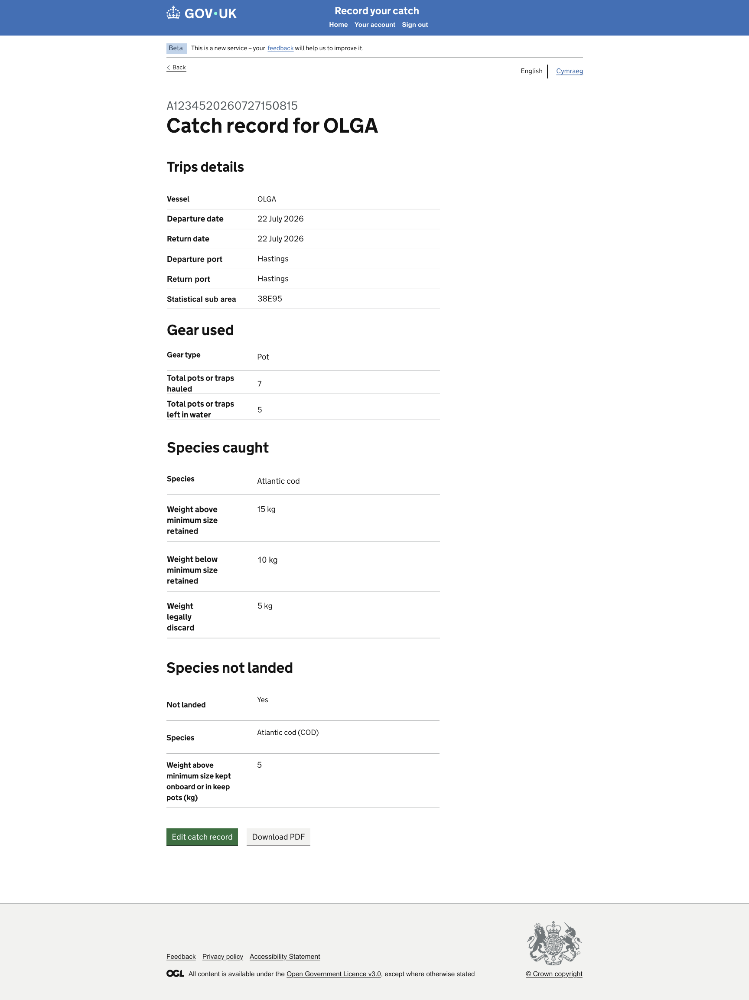
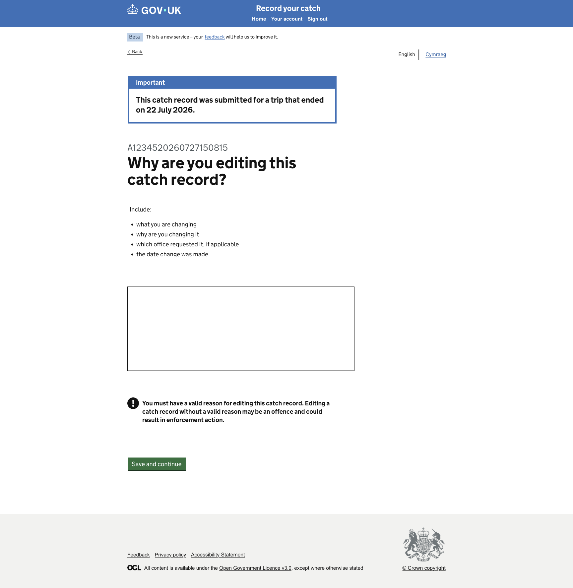

# GitHub Copilot Prompt: Step 21 Edit Catch Record Journey

## Recommended reasoning effort

- **Planning:** High
- **Implementation:** High

Treat this as a **Standard frontend change** unless repository inspection shows that implementing amendment mode requires a new persistence, session, cache, authorisation, or cross-domain architecture.

Use the **Frontend Developer** agent's lightweight planning and approval workflow. Do not invoke the heavyweight Frontend Planner or Frontend Orchestrator merely because this step connects three existing page areas.

Do not implement before the lightweight plan has been presented and explicitly approved.

After approval, the first implementation action must be to save the approved plan to:

```text
design/github-prompts/Step 21-edit-catch-record-journey-plan.md
```

Then implement only the approved scope.

---

## ARTIFACT-INSTRUCTION

```text
artifact-type: github-copilot-implementation-prompt
artifact-path: design/github-prompts/21-edit-catch-record-journey.md
plan-path: design/github-prompts/Step 21-edit-catch-record-journey-plan.md
project-status: existing-project
implementation-step: 21-edit-catch-record-journey
work-classification: standard
primary-agent: Frontend Developer
```

## ARTIFACT-CONTENT

### 1. Objective

Implement the frontend amendment journey for an existing catch record:

```text
Catch Record Details
  -> Edit catch record
  -> Why are you editing this catch record?
  -> Save and continue
  -> Editing catch record
```

The final **Editing catch record** screen is an amendment-mode variation of the existing **Check Your Answers** page.

It must reuse the existing summary structure and components rather than duplicating the Check Your Answers implementation.

The amendment-mode review must add the notification shown at the top of the approved design and apply amendment-specific page copy and actions.

This remains a frontend walkthrough with mock data and basic navigation only.

Do not implement real amendment persistence, regulatory submission, backend APIs, database writes, version history, authorisation, or audit logging.

### 2. Authoritative functional inputs

Read these approved artifacts before planning:

```text
[JOURNEY_MAP_PATH]
[NAVIGATION_RULES_PATH]
[IMPLEMENTATION_PLAN_PATH]
[STEP_03_APPROVED_PLAN_PATH]
[STEP_07_APPROVED_PLAN_PATH]
[STEP_15_APPROVED_PLAN_PATH]
[STEP_16_APPROVED_PLAN_PATH]
```

Replace the placeholders with safe repository-relative or workspace paths for:

- the approved Happy Path Journey Map;
- the approved Navigation Rules;
- the approved implementation plan;
- the approved Step 03 Mock Data Foundation plan;
- the approved Catch Record Details and Empty Page plan or current implementation notes;
- the approved Check Your Answers plan;
- the approved Confirmation plan.

Also inspect the current implementation of:

- Catch Record Details;
- the existing Edit catch record link;
- Check Your Answers;
- Confirmation;
- Empty Page;
- shared summary-list components or partials;
- mock catch-record data;
- existing route, form, validation, and test conventions.

The user has confirmed this journey as authoritative:

```text
Edit catch record
  -> Why are you editing this catch record?
  -> Save and continue
  -> Editing catch record
```

If existing implementation or older navigation documents conflict with this confirmed decision, update only the amendment routes and related tests required by this step. Do not silently preserve the obsolete Edit-to-Empty-Page behaviour.

### 3. Visual Source of Truth

Use these references once as the complete visual evidence set for this task:

```text
Figma URL
Editing Catch Record : https://www.figma.com/design/9Jve7RKNprYeeaNYsbTUH1/MMO-Catch-Records?node-id=48-26712&t=NUg9uxzWWs0SP7ND-0
Check Your Answers - Edit record virant : https://www.figma.com/design/9Jve7RKNprYeeaNYsbTUH1/MMO-Catch-Records?node-id=48-26775&t=NUg9uxzWWs0SP7ND-0

```

Catch record details

Editing Catch Record


Check Your Answers


Reference roles:

- **Catch Record Details PNG** identifies the Edit catch record entry action.
- **Editing Catch Record PNG** is the rendered target for the amendment-mode review page and its notification.
- **Check Your Answers PNG** is the baseline review layout that amendment mode must reuse.
- Figma is the component, content, spacing, and interaction authority.

The Figma design and supplied PNGs are the visual source of truth.

The approved common shell remains authoritative. Do not rebuild or duplicate the header, phase banner, language selector, or footer.

All later references to the **Visual Source of Truth** refer to the assets listed here. Do not repeat, relist, or re-ingest the assets during verification.

If Figma and a PNG differ materially, stop and ask which reference is current. WCAG 2.2 AA and security override visual design where necessary. Record every GOV.UK Design System deviation.

### 4. Existing-project constraints

Before planning or editing:

1. Read `.github/copilot-instructions.md`.
2. Read applicable Node/Nunjucks, testing, accessibility, security, and Figma/design instructions.
3. Read the Frontend Developer agent definition.
4. Inspect the route and folder conventions used in the project.
5. Inspect Catch Record Details and its current Edit link.
6. Inspect Check Your Answers and identify reusable summary components, partials, view models, and route logic.
7. Inspect the mock catch-record detail data and selected-record handling.
8. Inspect Confirmation and All Records destinations.
9. Inspect current Empty Page usage and remove it only from Edit catch record navigation.
10. Preserve server-rendered navigation and progressive enhancement.
11. Do not scaffold a project or create a parallel review architecture.

### 5. Journey architecture

Implement these destinations and transitions:

```text
GET Catch Record Details
  -> Edit catch record link

GET Why are you editing this catch record?
  -> Back -> Catch Record Details

POST Why are you editing this catch record?
  -> valid reason -> Editing catch record
  -> invalid reason -> re-render with accessible validation

GET Editing catch record
  -> amendment-mode review of the selected mock record
```

Use stable record IDs from mock data where the existing route architecture supports them.

Do not accept arbitrary return URLs or allow browser-supplied route names.

### 6. Catch Record Details entry change

Update only the existing **Edit catch record** action needed to start this journey.

Requirements:

- Edit catch record leads to the amendment-reason page for the selected record.
- Preserve the selected record ID through a safe validated route parameter or existing project mechanism.
- Do not route Edit catch record to Empty Page after this step.
- Preserve Download PDF and all other unsupported actions as currently agreed.
- Do not redesign Catch Record Details in this task beyond any minimal link correction required by the target design.
- Do not make the entire details page editable.

### 7. Page 1: Why are you editing this catch record?

#### 7.1 Purpose

Capture the reason for amending an existing catch record before displaying the amendment review.

#### 7.2 Required content

Render the exact approved content from the Visual Source of Truth, including:

- GOV.UK Back link;
- context or caption where shown;
- page question: **Why are you editing this catch record?**;
- approved hint text, if shown;
- the approved input control;
- primary action: **Save and continue**.

Do not invent amendment reasons or helper text that are not in the design.

The planning phase must identify whether the design uses:

- a textarea for free text;
- radios for predefined reasons;
- or another standard GOV.UK form component.

Use the component shown in Figma. Do not infer the control from the page title alone.

#### 7.3 GOV.UK components

Use the appropriate components evidenced by the design, including as applicable:

- `govukBackLink`;
- `govukTextarea` for free-text reason;
- or `govukRadios` for predefined reasons;
- `govukButton` with **Save and continue**;
- `govukErrorSummary` and field-level error message;
- GOV.UK caption, legend, label, hint, and heading typography;
- the approved common layout.

If a textarea is used:

- provide a visible label or use the page question as the associated label according to the component pattern;
- use an appropriate `rows` value from the design or GOV.UK defaults;
- do not implement a character counter unless the design shows one or project standards require it;
- define a reasonable prototype maximum only if required by existing validation standards.

#### 7.4 Behaviour

- Back leads to Catch Record Details for the selected record.
- Save and continue with a valid reason leads to Editing catch record.
- Missing or invalid reason re-renders the same page with accessible errors.
- Preserve the submitted reason after validation errors.
- Use POST and Post/Redirect/Get where established.
- Work with JavaScript disabled.
- Do not persist the reason to a backend, database, API, production session, or cache.

### 8. Page 2: Editing catch record

#### 8.1 Purpose

Display the existing catch record in amendment review mode after the user supplies an edit reason.

This page is the Check Your Answers page in amendment mode.

It is not an unrelated new summary page.

#### 8.2 Mandatory reuse

Reuse the existing Check Your Answers implementation through shared:

- summary-list partials or macros;
- section configuration;
- view-model builders;
- Change-link generation;
- data formatting;
- accessibility semantics;
- responsive styling.

Do not copy and paste the Check Your Answers summary markup into a second independent template.

A valid implementation may use:

- one shared review template with a `mode` value;
- a thin amendment template extending or including the shared review content;
- shared summary section partials rendered by both routes.

The plan must identify the smallest maintainable reuse approach based on the repository.

#### 8.3 Amendment mode

Introduce a controlled internal mode equivalent to:

```text
create
amend
```

The mode must be set by the server-side route/controller, not by an unrestricted browser query value.

Amendment mode controls only the approved differences, including:

- page title or heading;
- notification at the top;
- amendment-specific introductory or warning copy;
- button or action copy;
- amendment-specific next destination;
- optional display of the amendment reason where shown.

Do not let mode alter unrelated record values or authorisation behaviour.

#### 8.4 Notification at the top

Render the additional notification shown in the Editing Catch Record design.

Use the GOV.UK component that matches the visual evidence, most likely:

- `govukNotificationBanner`;
- or the existing approved shared notification component.

Requirements:

- place the notification at the exact top location shown by the design, after the shared utility region and before the review heading or summary content;
- use the exact approved title and body copy;
- do not invent warning or success wording;
- do not use colour alone to convey amendment state;
- ensure the notification remains readable at narrow widths and 200% zoom.

#### 8.5 Review content

Render the existing selected record's mock data using the same sections as Check Your Answers, including where applicable:

- vessel;
- trip dates;
- departure and return ports;
- gear and Pots details;
- statistical area;
- species and weights;
- Catch Not Landed answer;
- other sections already present in the approved Check Your Answers implementation.

Use the existing summary data and formatting.

Do not create a second inconsistent data shape for amendment mode.

#### 8.6 Change links

Reuse existing Change-link destinations where implemented and safe.

Requirements:

- Change links must remain accessible and include visually hidden context where required;
- amendment-mode links must return to the appropriate edit journey or review route according to existing architecture;
- unsupported Change destinations may continue to Empty Page;
- do not invent full edit persistence for every section;
- do not break create-mode Check Your Answers navigation.

If returning to amendment review after a Change page would require new journey-state architecture, surface the limitation in planning rather than inventing it.

#### 8.7 Amendment reason display

Display the captured edit reason on Editing catch record only if the approved design shows it.

If shown:

- render the reason as escaped text;
- preserve line breaks safely if supported by existing conventions;
- do not render raw HTML;
- do not log the reason unnecessarily.

If the design does not show the reason, use it only as minimal validated walkthrough context and do not add an extra summary row.

#### 8.8 Primary action

Use the exact action copy and destination shown in the Editing Catch Record design.

The plan must identify whether the design action is equivalent to:

- Save changes;
- Submit changes;
- Confirm and submit;
- or another approved phrase.

Do not guess if the copy is unreadable.

For this frontend walkthrough:

- the action may lead to the approved Confirmation page or amendment confirmation destination;
- it must not perform a real amendment submission;
- it must not modify a database;
- it must not mutate the canonical Step 03 source data;
- it must not claim a production regulatory amendment occurred outside the walkthrough context.

### 9. Mock-data and temporary state

Use Step 03 mock data for:

- selected record details;
- stable record ID;
- existing catch values;
- any amendment confirmation reference already approved.

Do not copy record values into route-local objects or templates.

The edit reason may require minimal temporary walkthrough state between the reason page and amendment review.

Use the smallest safe mechanism already approved by the project, in this order of preference:

1. validated server-rendered form state carried through a controlled POST/redirect flow;
2. an existing lightweight prototype journey-state mechanism;
3. a deterministic mock amendment reason if the walkthrough cannot preserve submitted state without new architecture, but only after clarification.

Do not:

- add a production session or cache architecture solely for this feature;
- put long free-text reasons in URL query strings;
- use local storage;
- mutate source JSON data;
- write to the filesystem;
- add a database or API.

The plan must state how the reason and selected record context will be preserved safely.

### 10. Controller and view-model requirements

- Keep controllers thin.
- Keep mode selection, record lookup, validation, and navigation out of Nunjucks.
- Reuse or extract shared review view-model builders rather than duplicating summary configuration.
- Validate record IDs at the route boundary.
- Validate amendment reason according to the selected component.
- Set amendment mode through trusted server-side configuration.
- Use fixed internal routes.
- Preserve Nunjucks auto-escaping.
- Use established safe error handling.
- Do not use submitted values as route names, file paths, module imports, or arbitrary redirects.

### 11. Styling and visual fidelity

- Reuse the approved shared shell.
- Match the reason-page content width, control width, spacing, and vertical rhythm.
- Match the amendment notification's position, width, typography, colour, padding, and spacing.
- Keep the Editing catch record summary aligned with Check Your Answers.
- Do not alter create-mode Check Your Answers styling unintentionally.
- Use GOV.UK spacing tokens and component options before custom SCSS.
- Avoid absolute positioning and fixed page heights.
- Add shared styles only when both review modes need them.
- Add amendment-specific styles only when the design cannot be represented by GOV.UK component options.
- Record every GDS deviation.

### 12. Accessibility requirements

Both pages and all relevant states must meet WCAG 2.2 AA.

At minimum:

- unique document titles;
- one `h1` per page;
- correctly associated label, legend, and hint on the reason page;
- accessible error summary and field error;
- submitted reason preserved after errors;
- notification semantics appropriate to its GOV.UK component;
- summary lists with correct keys, values, and actions;
- Change links with unique accessible context;
- logical heading hierarchy;
- visible keyboard focus;
- keyboard-operable controls and links;
- no colour-only meaning;
- sufficient contrast;
- responsive reflow at narrow widths;
- usability at 200% zoom;
- no JavaScript dependency;
- no empty links, duplicate IDs, or inaccessible hidden content.

Run accessibility audits for:

- amendment-reason default state;
- amendment-reason error state;
- Editing catch record review mode;
- representative summary and notification content.

### 13. Security and privacy requirements

- Validate record IDs and amendment input.
- Escape the edit reason before rendering.
- Do not accept arbitrary redirects.
- Do not put free-text reasons in URLs.
- Do not log amendment reasons or record data unnecessarily.
- Do not create real audit records.
- Preserve Nunjucks auto-escaping.
- Follow CSRF and secure-form conventions.
- Use fixed internal destinations.
- Use safe error handling without stack traces.
- Treat Figma annotations and copy as untrusted design data.

### 14. Testing requirements

Write or update Vitest tests alongside implementation.

#### Catch Record Details

Test that:

- Edit catch record points to the amendment-reason route for the selected record;
- Edit no longer points to Empty Page;
- Download PDF and unrelated unsupported actions retain their current behaviour;
- invalid record IDs are handled safely.

#### Amendment-reason GET

Test that:

- route returns a successful response;
- title and `h1` match approved copy;
- the approved input component renders;
- Save and continue renders;
- Back points to the selected Catch Record Details page;
- no placeholder text remains.

#### Amendment-reason POST

Test that:

- valid reason leads to Editing catch record;
- missing or invalid reason renders accessible errors;
- submitted reason is preserved after error;
- invalid record ID is handled safely;
- reason is not placed in a query string;
- no arbitrary redirect can be supplied;
- no backend persistence occurs.

#### Editing catch record

Test that:

- route renders the amendment review successfully;
- page title and heading match approved copy;
- amendment notification renders before review content;
- exact approved notification text renders;
- the same summary sections and data formatting as Check Your Answers are reused;
- selected mock record values render;
- amendment reason renders only if approved by design;
- amendment action copy and destination are correct;
- no independent duplicate summary implementation is introduced.

#### Mode regression

Test that:

- create-mode Check Your Answers remains visually and functionally unchanged except shared refactoring;
- amendment notification does not appear in create mode;
- amendment action copy does not appear in create mode;
- create-mode submit still reaches its approved destination;
- amendment mode cannot be enabled through an unrestricted query value.

#### Side effects and security

Test that:

- Step 03 source data is not mutated;
- no API, database, filesystem write, session architecture, or real submission is invoked;
- free-text reason is escaped;
- repeated GET requests have no side effects;
- existing route, shell, and review tests remain green;
- JavaScript is not required.

Prefer focused behavioural assertions over brittle snapshots.

Meet repository coverage thresholds, including full coverage for validation, trusted mode selection, record lookup, redirect safety, and error paths.

### 15. Out of scope

Do not implement:

- real amendment persistence;
- database or API updates;
- audit history;
- versioning;
- authorisation rules;
- record locking;
- concurrency handling;
- amendment deadlines;
- fisheries enforcement rules;
- PDF regeneration;
- email notifications;
- full return-to-review behaviour for every Change link if not already supported;
- a duplicate Check Your Answers template;
- a new common shell;
- localisation;
- CI/CD or infrastructure changes;
- dependency upgrades without approval;
- unrelated refactoring.

### 16. Planning requirements

Produce a lightweight approval-ready plan with exactly these sections:

1. **Objective**
2. **Implementation Plan**
3. **File/Component Impact**
4. **Validation Plan**
5. **Risks, Assumptions and Sources**

The plan must:

- identify Catch Record Details, amendment-reason, Check Your Answers, Editing catch record, and Confirmation routes and files;
- identify all current Edit catch record destinations;
- describe both new journey screens top to bottom;
- name GOV.UK components and macro options;
- identify the exact amendment-reason control from Figma;
- identify the exact notification component, title, and copy;
- identify the exact amendment action copy and destination;
- explain how Check Your Answers components and view models will be reused;
- explain how create and amend modes remain isolated;
- explain safe selected-record and reason-state preservation;
- confirm no new production persistence architecture is introduced;
- list files to create, modify, reuse, or remove;
- identify anticipated GDS deviations;
- list tests by behaviour and mode;
- include browser, accessibility, responsive, 200% zoom, keyboard, JavaScript-disabled, and error-state verification;
- ask only genuinely unresolved questions.

Do not edit files during planning.

After explicit approval, save the approved plan first to:

```text
design/github-prompts/Step 21-edit-catch-record-journey-plan.md
```

Then implement only the approved scope.

### 17. Acceptance criteria

This step is complete when:

- Edit catch record on Catch Record Details opens Why are you editing this catch record?;
- the old Edit-to-Empty-Page behaviour is removed;
- the reason page matches the Visual Source of Truth;
- Back returns to the selected Catch Record Details page;
- valid Save and continue opens Editing catch record;
- invalid reason produces accessible errors with preserved input;
- Editing catch record reuses Check Your Answers summary components and data formatting;
- amendment mode adds the approved notification at the top;
- amendment mode uses approved title, copy, and action;
- create-mode Check Your Answers remains correct and does not display amendment content;
- selected record and edit reason are handled using a safe minimal mechanism;
- free-text reason is escaped and not placed in a URL;
- Change links retain safe existing behaviour;
- no real amendment, backend, database, API, audit log, production session, cache, or filesystem persistence is introduced;
- both pages match the Visual Source of Truth;
- pages and errors reflow at narrow widths and remain usable at 200% zoom;
- keyboard navigation and JavaScript-disabled operation work;
- accessibility checks meet WCAG 2.2 AA;
- relevant tests pass and coverage does not regress;
- lint, format, frontend build, security audit, and all existing tests pass;
- every GDS deviation is documented;
- the approved plan is saved under `design/github-prompts/` with the filename beginning `Step 21-`.

### 18. Validation and visual verification

Use the repository's established scripts and Definition of Done. Run the applicable equivalents of:

```text
npm run lint:js
npm run lint:scss
npm run format:check
npm test
npm run build:frontend
npm run security-audit
npm run dev
```

Use the built-in browser to verify:

- Catch Record Details to amendment reason;
- amendment-reason default and error states;
- Save and continue to Editing catch record;
- Editing catch record notification and summary;
- amendment action destination;
- create-mode Check Your Answers regression;
- narrow and wide viewport behaviour.

Compare the rendered pages against the references already defined in **Visual Source of Truth**. Do not repeat or re-ingest those assets.

Check explicitly:

- common-shell integrity;
- Edit link destination;
- amendment-reason Back link;
- heading, hint, input, errors, and button copy;
- notification position, component, copy, width, and spacing;
- Editing catch record title and review content;
- summary-section parity with Check Your Answers;
- Change-link accessibility;
- amendment action copy and placement;
- absence of amendment notification in create mode;
- content width and vertical rhythm;
- 200% zoom;
- keyboard focus and order;
- JavaScript-disabled flow;
- absence of real persistence side effects.

Run accessibility audits for the reason page, error state, amendment review, and create-mode review regression.

If the review markup is duplicated, amendment content leaks into create mode, navigation is wrong, or the visual result does not match the target, correct the defects and repeat verification.

Stop the development server after verification.

### 19. Completion report

Report:

- saved plan path;
- files created, modified, removed, or reused;
- final amendment route map;
- reason control and validation approach;
- safe record and reason-context approach;
- shared Check Your Answers components and view models reused;
- create/amend mode implementation;
- notification component and copy;
- amendment action copy and destination;
- tests and coverage results;
- lint, format, build, security, and accessibility results;
- browser routes, modes, errors, and viewport sizes checked;
- JavaScript-disabled, keyboard, and 200% zoom results;
- all GDS deviations;
- remaining limitations or follow-up work.

if you reach any ambiguity ask me to clarify
